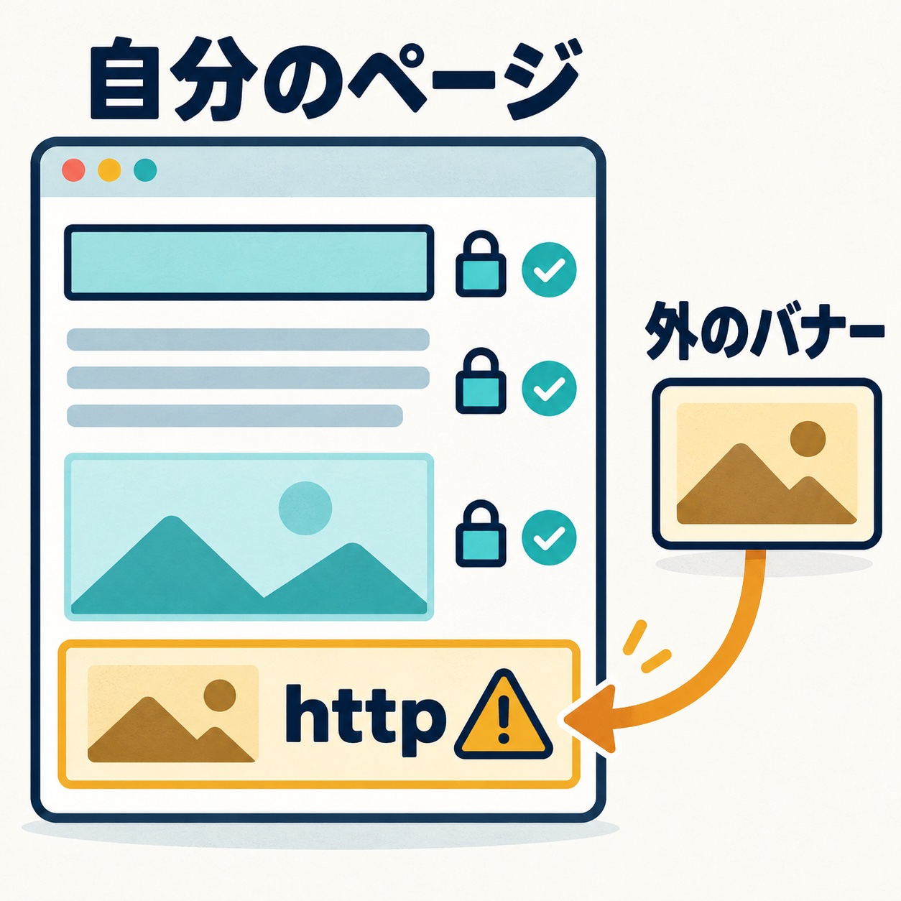
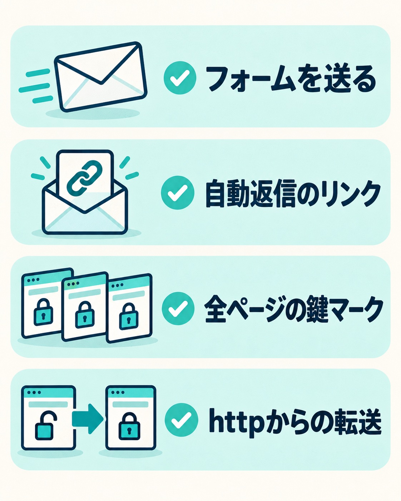

ホームページを「https」にしたい。サーバーの管理画面を見ると、無料の証明書がボタン一つで入れられる。それなら数分で終わりそうに見えます。

ところが、証明書を入れただけでは、常時SSL化は終わりません。ページの中に「http://」で読み込んでいるものが残っていると、せっかくhttpsで開いても、鍵マークに警告が出ます。

今回の例は、ある団体のホームページです。間に入っているディレクターから「SSL化したい。見積もりがほしい」と相談を受け、切り替える前にサイトの中身を一通り調べました。この記事では、そのとき見つかったことを中心に、常時SSL化の注意点をまとめます。

## 証明書を入れるだけでは終わらない理由

SSL化には2つの段階があります。

1つ目は、サーバーに証明書を入れて、httpsで開けるようにすること。ここは多くのレンタルサーバーで、管理画面の操作だけで終わります。

2つ目は、どこから来た人もhttpsのページを見るようにすることです。httpで開いた人をhttpsへ自動で転送し、ページの中に残っているhttpの読み込みもhttpsに書き換えます。「常時SSL化」と呼ぶのは、ここまで含めた状態です。

手間がかかるのも、つまずくのも、2つ目のほうです。ページを見ただけでは、中にhttpが残っているかどうかは分かりません。

## 切り替える前に調べたこと

今回のサイトは、WordPressではなく、HTMLのページを並べて作ったサイトでした。リンクを辿って全ページを巡回し、サーバーの中も見て、次のものが見つかりました。

**1. 自分のサイトのURLが、httpで直接書き込まれていた**
ページ同士のリンクや画像の場所が、「http://」から始まる形で書かれていました。これはhttpsに書き換えるか、ドメインを省いた書き方に直せば済みます。数は多くても、機械的に置き換えられます。

**2. 全ページに貼ってある外のバナーが、httpで読み込まれていた**
今回いちばん大事だったのは、自分のページではなく、ほぼ全ページに貼ってあった外のサイトのバナーでした。httpsのページの中でhttpの画像を読み込むと、ブラウザは警告を出したり、読み込みを止めたりします。自分のサイトのURLだけを直しても、ここが残っていると鍵マークはきれいになりません。読み込み先のサイトがhttpsに対応していれば、書き換えるだけで済む見込みです。

_自分のページをhttpsにしても、外から読み込むバナーにhttpが残っていないかを確かめます。_

**3. 「www」の有無が混ざっていた**
サイトそのものは「www」なしで開くのに、中のURLは「www」付きで書かれていました。どちらかに揃えないと、転送の設定が中途半端になります。切り替えのついでに、どちらに寄せるかを決めておきます。

**4. 自動返信メールの本文に、httpのURLが入っていた**
問い合わせた人に届く自動返信メールの文面に、「http://」から始まるホームページのURLが書かれていました。ページをいくら調べても、メールの文面までは見えません。フォームの設定ファイルを開いて、初めて分かります。

**5. どこからも辿れない古いページが、公開された場所に残っていた**
サーバーの中に、サイト全体の古いコピーや、どこからもリンクされていない古いフォームが残っていました。リンクから辿れないので、巡回では見つかりません。それでも公開された場所にある以上、URLを知っていれば誰でも開けます。SSL化の対象に含めるか、そもそも残すのかを、持ち主と決める必要があります。

もう一つ、フォームが何本あるかを持ち主側に確かめたところ、運用している人が「今使っている」と思っていたフォームと、調査で辿れたフォームが1本食い違っていました。サーバーには両方が残っていて、どちらかは使われていないことになります。切り替える前に、どれが現役かを確定させておきます。

## WordPressのサイトで気をつけること

WordPressのサイトでも、考え方は同じです。ただ、httpが残る場所が少し違います。

- **管理画面の「WordPressアドレス」と「サイトアドレス」**：ここをhttpsに変えるのは、証明書が入ってhttpsで開けることを確かめてからにします。先に変えると、管理画面に入れなくなることがあります。この欄を書き間違えたときに起きることは「[WordPressにログインできないときの原因と復旧手順](/blog/wordpress-cannot-login)」と「[WordPressの画面が真っ白になったら](/blog/wordpress-white-screen-recovery)」にまとめています
- **記事や固定ページに入れた画像**：投稿の中の画像は、入れたときのURLのまま保存されていることが多く、http://のまま残ります。データベースの中をまとめて書き換えることになるので、先にバックアップを取ります
- **転送の設定が二重になっていないか**：サーバー側の転送と、WordPress側の設定やプラグインの転送が重なると、ページが行ったり来たりして開かなくなることがあります。転送はどこか1か所で行います

## 「SSL」と「TLS」の違いは気にしなくていい

今回、持ち主側の打ち合わせで「今はSSLではなくTLSという新しい方式になっている。方式のバージョンを確かめてから決めるべきでは」という意見が出ました。

「SSL化」は昔からの呼び名で、実際につながっている方式は今はTLSです。今回のサーバーは新しい方式にすでに対応していて、利用者側の手続きはいりません。制作する側がやることは、ふつうのSSL化の作業と変わりません。言葉の違いで判断を止める必要はない、と整理しました。

## 書き換える人と、確かめる人を分けない

見積もりは、証明書の設定ではなく、「事前の調査」「サイトの中のURLの書き換えと転送の設定」「フォームの動作確認」に分けて出しました。証明書の設定そのものは管理画面の操作だけで終わるので、作業代には入れていません。

途中で、書き換えはディレクターの側で行い、こちらはフォームが動かなくなったら直す、という分け方の相談がありました。これは、まとめてこちらで引き受けることにしました。書き換えた人とフォームを確かめる人が同じなら、フォームが動かないとき、書き換えのせいか、もともと動いていなかったのかを、その場で判断できます。分けると、そのたびに確認の往復が生まれます。

自動返信メールの文面のように、誰が書き換えても必ず直す場所もあります。「壊れたら直す」という分け方だと、こうした場所が誰の担当にも入らなくなります。

## 切り替えたあとに確かめること

切り替えたら、次の4つを確かめて「終わった」と判断します。

1. **フォームを実際に送る**：入力から送信まで一通り通して、通知メールが持ち主に届くか
2. **自動返信メールの中のリンク**：問い合わせた人に届くメールのURLが、httpsになっているか
3. **鍵マークが全ページで出ているか**：トップページだけでなく、全ページで警告が出ていないか
4. **httpで開いたら、httpsに飛ぶか**：古いURLでブックマークしている人や、外のサイトからのリンクで来た人も、httpsのページに着くか

_切り替えたあとは、フォームの送信、自動返信のリンク、全ページの鍵マーク、httpからの転送を確かめます。_

## まとめ

常時SSL化は、証明書を入れて終わりではありません。手間がかかるのは、ページの中に残ったhttpを探して書き換えるところです。

- 自分のサイトのURLだけでなく、外から読み込んでいるバナーや画像を見る
- 「www」の有無を、どちらかに揃える
- 自動返信メールの文面など、ページには出ない場所のhttpも探す
- どこからも辿れない古いページやフォームが残っていないかを見て、扱いを決める
- 切り替えたあとは、フォーム・自動返信・全ページの鍵マーク・httpからの転送を確かめる

WordPressのサイトなら、ほかにも守っておきたいところがあります。サイト全体の守り方は「[WordPressセキュリティ対策ガイド](/blog/wordpress-security-measures)」にまとめています。
