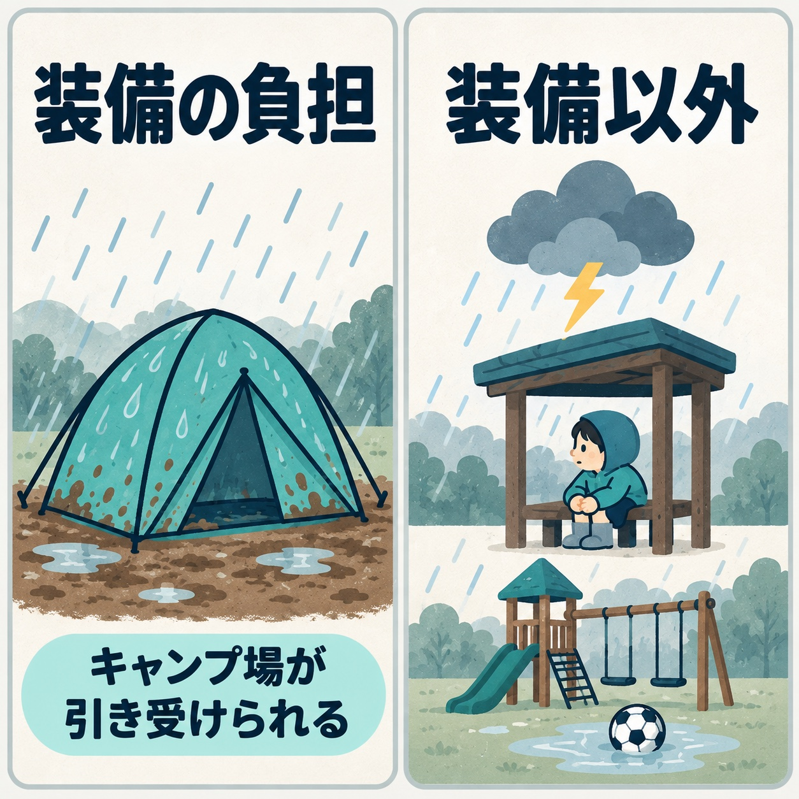
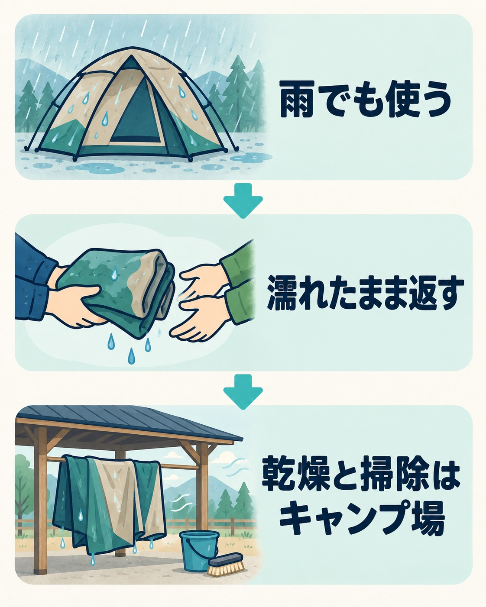

キャンプ場にとって、雨予報はそのまま空き区画につながります。私たちのキャンプ場（キャンプビレッジノーム）でも、雨の日に客足が落ちることは、役員会でずっと課題になっていました。

この9月から、雨予報の日に限って使える「雨の日応援セット」を始めました。この記事では、何を考えてこの形にしたのか、なぜ値引きではなかったのか、なぜ調べ切る前に始めたのか、始めてみてどうだったのかを書きます。

## お客さんは「雨」の何が嫌なのか

ミーティングで出てきた仮説は、「お客さんは雨そのものより、自分のテントが汚れるのが嫌なのではないか」というものでした。

調べてみると、雨予報でキャンセルする理由は、大きく2つに分かれていました。

- 装備の負担：自分のテントや道具を濡らしたくない・汚したくない。雨の中の設営と撤収が大変。帰ってから干す場所がない、泥を落とすのに時間がかかる
- 装備以外：警報や増水など安全への不安、子どもの体調、外で遊べず楽しくなさそう

_雨の日の不安を分けて考え、キャンプ場が引き受けられる装備の負担から手をつけました。_

どちらがどのくらいの割合なのかを示す数字は、国内では見つかりませんでした。

安全への不安は、キャンプ場がどうにかできるものではありません。一方で装備の負担は、もともと貸し出しているテントやタープを組み合わせれば、新しくお金をかけずに引き受けられます。だから、装備の負担から手をつけることにしました。

## 雨予報の日だけ使えるレンタルセット

セットは3つです。

- テント・タープ・薪・炭をまとめた基本のセット
- 基本のセットにSUPを付けたセット
- 基本のセットにサウナを付けたセット

SUPとサウナは、雨でも続けられます。お客さんも「どうせ濡れるから」と割り切りやすい。外で遊べないという不安には、こちらで応えるつもりです。

使えるのは、前日の13時の時点で、降水確率が60%以上の日です。申込は前日で受け付け、支払いは当日です。13時にしたのは、前日に申し込んでもらう流れと合わせるためでした。

基準の降水確率は、最初は50%で考えていました。同じように雨予報と連動したプランを出している施設の例を参考にした数字です。現場の責任者と話して、60%に上げました。予報が外れて晴れた場合も、予約済みのお客さんには当初の内容で対応します。

## 値引きより「濡れたまま・汚れたまま返却OK」を前に出した

雨の日の対策というと、まず値引きが思い浮かびます。ただ、値引きをしても、「テントが汚れる」「帰ってから干して泥を落とすのが大変」という負担は残ります。

調べた中で、レンタルで本当に解決できるのは、「自分の道具を汚したくない」と「家で乾かす負担」の2つでした。それも、「濡れたまま返していい。乾燥と掃除はキャンプ場がやる」という運用があって、初めて成り立ちます。借りたテントでも、返す前に泥を落とさなければと思えば、負担はなくなりません。

_濡れたまま返してもらい、乾燥と掃除はキャンプ場で引き受ける運用です。_

そこで、現場の責任者とのミーティングで、いちばん前に出すのは値引きではなく「濡れたまま・汚れたまま返却OK」と決めました。料金は、実際にある単品レンタルの価格を並べたうえで、セットの価格を見せる形にしています。

## 調べ切る前に、小さく出すと決めた

私はふだん、調べて、分析して、目標を決めてから動く方です。今回はそれをやめました。理由は3つです。

- 新しくかかるお金が、ほとんど無い
- 雨の多い季節を逃したくなかった
- 小さく出してお客さんの反応を見ること自体が、いちばんの調査になる

細かい目標や計画を最初から固めると、計画が重くなって始まらない、ということもありえます。それより、いつからいつまでやるかを決めておく方が大事だと考えました。実施期間は1年です。始めたことが「うまくいったのか、まだ続いているのか」も分からなくなるのを避けたかったからです。

もう一つ、この案がミーティングで出た翌日に、現場の責任者がもうチラシを作ってきてくれました。その勢いを、計画づくりで止めたくありませんでした。

## 始めてみてどうだったか

9月に始めて、すぐに雨予報の日の申込が入りました。告知はホームページに載せただけで、受付は前日の電話です。選ばれたのは、基本のセットでした。

始めてすぐに反応があったのは、正直に言って意外でした。ただ、その後の数は、まだ現場から聞いていません。これから少しずつ増えていけばいいと思っています。

返ってきたテントやタープの乾燥と掃除は、現場の手が空いたときにやっています。干すためのロープを増やしたり、倉庫で干したりしています。進めているのはキャンプ場の責任者で、私から打ち合わせで決めたこと以外に指示したことはありません。困ったという声は、今のところ上がってきていません。

キャンセルについては、減った手応えはあると現場は言っています。ただ、これは雨の日応援セットだけの効果ではありません。同じ時期に、キャンセル料がかかり始める日を宿泊日に近づけています。むしろ、そちらの方が効いているのかもしれません。

## 同じように雨の日に悩んでいる方へ

ここまでで分かっていることを、そのまま書きます。

- 手元にある貸し出し品と決まりの組み合わせだけで、新しい投資なしに始められた
- ホームページに載せただけでも、始めてすぐ申込が入った
- キャンセルが減った手応えはあるが、キャンセル料の決まりも同じ時期に変えたので、どちらが効いたのかは切り分けられていない

一つの施策の効果だけを取り出すのは、思っていたより難しいものです。決めた期間が終わったところで、振り返るつもりです。そのときに、また書きます。
