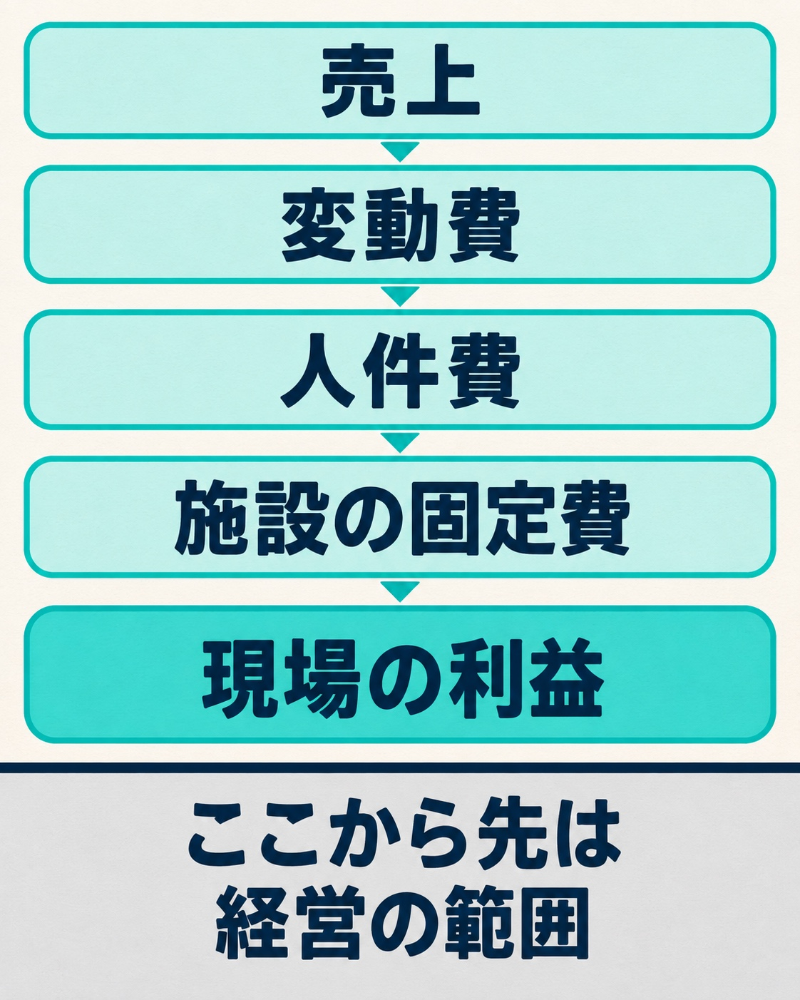
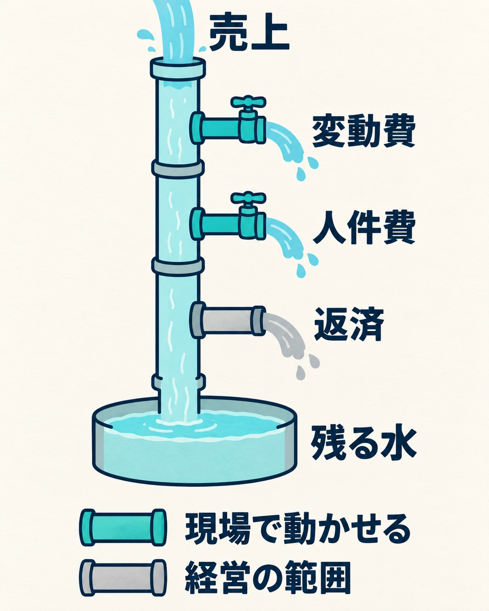

私たちの会社（HAMAYOUリゾート）は、山梨県の西湖でホテル、日帰り温泉、キャンプ場を営んでいます。祖父の代から続く家族経営の会社で、私は常務をしています。

この9月から、施設ごとの損益を、それぞれの現場の責任者に毎月見せる運用を始めました。宿泊業の部門別損益を、そのままではなく「現場の利益」という形に作り直して見せています。この記事では、なぜ見せると決めたのか、どこまでを見せることにしたのか、現場にどう説明したのか、始めて1か月でどうなっているのかを書きます。

## 売上の伸びほど、決算手当を増やせない年があった

ありがたいことに、会社は長く黒字を続けてこられました。その中で私の役割を考えたとき、たどり着いたのは、これまで感覚や経験で決めてきたことを仕組みに落とし込み、次の世代に沈まない会社を残すことでした。沈まないとは、倒産しないということです。そのためには、数字をきちんと見ていく必要があります。

数字を見ていくと、気になることがありました。現場は売上を伸ばすことに一生懸命取り組んでくれています。私たちは毎年、業績に応じた決算手当を出しています。ところが、売上が上がっているのに、決算手当をそれに見合うほど増やせない年がありました。売上の伸びに比べて、手当を大きく増やせるほどには利益が伸びていなかったからです。

何かあったときに潰れないための資金を持つこと、銀行からお金を借りられる信用を保つこと、働いてくれる人に長く留まってもらうこと。どれも、売上だけでは足りず、利益が要ります。会社として、利益にもっと目を向けなければいけないと考えました。

## 成績表の項目を知らないと、改善のしようがない

ただ、役員が「利益、利益」と言うだけでは伝わらないと思いました。もし私が役員でない立場で働いていたら、「売上が上がっているのに、なぜ手当はそれほど増えないのか」と思うはずです。会社が取り分を多くしているのではないか、と感じる人が出てもおかしくありません。

役員は毎月、月次の決算書を見て、年度が終わると1年分の決算報告書で業績を確かめています。でも、その数字を実際に良くしていくのは、現場で働いてくれている人たちです。

決算書は、いわば会社の成績表です。成績表の項目を知らなければ、どこを良くすればいいのか分かりません。逆に、中身を見せれば、自分たちの努力がどの数字につながっているのかが分かります。それを評価の一部にできれば公平ですし、現場が数字を良くしてくれれば、決算も確実に良くなります。そう考えて、筋が通ったと感じたので、見せると決めました。

## 見せるのは「現場が動かせる数字」だけにした

経営者の本には、アルバイトの人まで決算書を見られるようにしている会社の例もありました。ただ、うちでいきなりそこまでやるのは難しいと考えました。

心配だったのは、見せなくていい部分まで見えてしまうことです。経営陣が見なければいけない数字と、現場が見るべき数字は、役割が違います。裏を返せば、現場は見なくていい数字もあるということです。そこをはっきり区切らないと、役員にも見せることに納得してもらえないと思いました。

そこで、見せる範囲を、現場の責任者が自分でコントロールできる数字に限りました。施設ごとに、売上から、材料費などの変動費、人件費、その施設の固定費を引いていき、最後に残る金額を「現場の利益」と呼んでいます。人件費からは、役員報酬のように現場では動かせない費用を外しています。そのため、「現場の利益」は決算書の数字とは一致しません。画面にも、ここから先は経営の責任範囲だと書いています。

_「現場の利益」までを現場に見せ、そこから先は経営の範囲として区切っています。_

もう一つ決めたのは、毎月の数字にアクションを縛らないことです。会計の数字が届くのはおよそ1か月遅れなので、「来月やること」を決めても時間が合いません。思いついた改善は、月をまたいでも追いかけられる形で残していきます。

## キックオフで、売上を水に例えて説明した

現場への説明は、毎年1回のキックオフで、全員の前で行いました。話したのは、「どうしてみんなが会社から給料をもらえるのか」「どうしたら給料が増えていくのか」です。

実際のある月の数字を1つ選び、水に例えました。売上という水が上から注がれ、会社の手元に残るまでに、少しずつ水が抜けていく。材料費などの変動費で抜け、人件費で抜け、銀行への返済でも抜ける。なぜそこで水が抜けるのかも、一つずつ説明しました。

_売上から出ていくお金を水に例え、現場が動かせる部分と経営の範囲を色で分けました。_

その上で、抜けていく水には、自分たちでコントロールできる量と、どうしようもない量があることを伝えました。この説明を先にしておいたので、施設ごとの数字を見せるときも、「コントロールできる範囲だけを見せる」という流れに自然につながりました。

## 始めて1か月、思ったようには回っていない

正直に言うと、思ったようにはいっていません。

現場の責任者から言われたのは、損益の数字は抽象的すぎて、それを見ても自分たちが何をすればいいのか決めきれない、ということでした。たとえば電気代の項目があっても、基本料金がいくらで、物価の上昇でどれだけ上がったのか、基本料金以外の使った分がどう動いているのかが分からなければ、どのくらい節電すればいいのかも考えられません。なるほど、と思いました。

一方で、経営の側から見れば、一つひとつの科目の細かい内訳まで毎月見ていくのは現実的ではありません。現場は細かい中身がないと具体的な手を考えにくく、経営は細かいところまで見ていられない。どちらの言い分にも一理あります。

すべてがその通りだとは思っていませんが、まずは受け止めて、ほかにどんな声があるかを聞くことにしました。数字を見せれば、あとは現場がどんどん考えてくれる。そこまで簡単ではない、というのが今の正直な実感です。

## これからのこと

運用はまだ始めて1か月ほどです。次の月のミーティングで、現場からどんな意見が出てくるのかを楽しみにしています。

部門別の損益を現場に見せるとき、何を見せて何を見せないかは、会社ごとに違うと思います。私たちは、現場が動かせる数字に区切ることと、見せる前に数字の流れを説明しておくことから始めました。見せた数字を、現場が次の行動に移せる形にするところが、これからの課題です。
