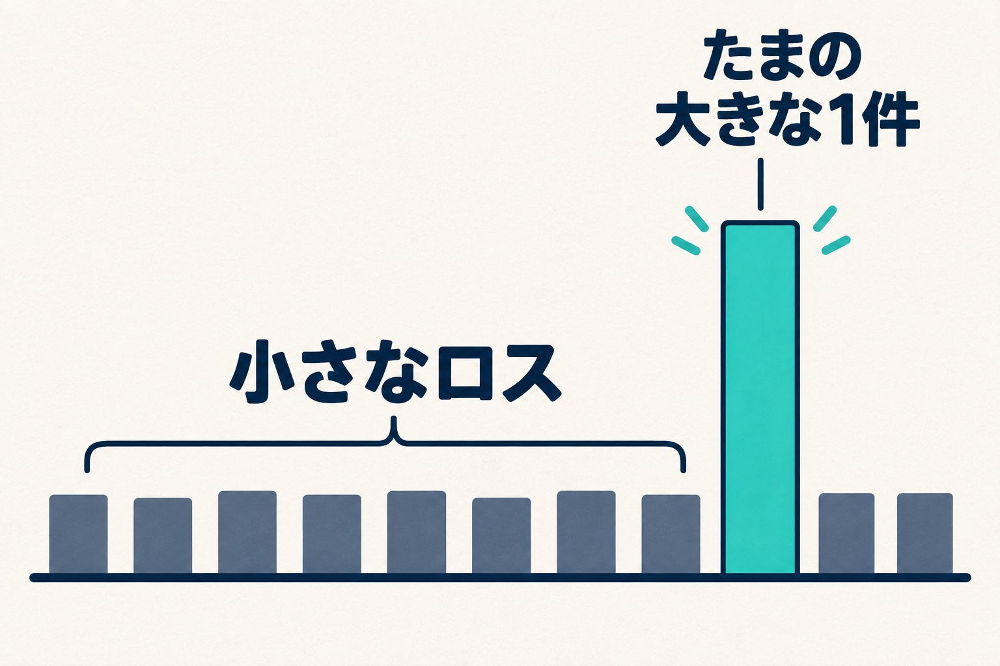
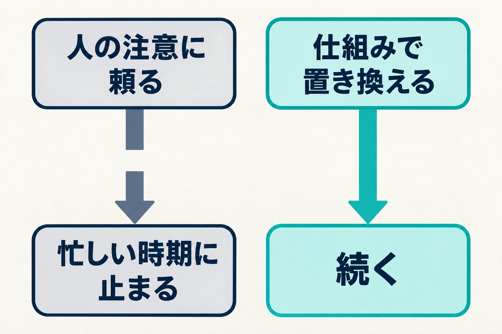

私たちの会社（HAMAYOUリゾート）は、山梨県の西湖でホテル、日帰り温泉、キャンプ場を営んでいます。私は常務をしています。

ホテルの調理場からは、毎月「廃棄処分記入表」が届きます。その月に捨てた食材と、捨てることになった理由を、調理場が書いてくれている表です。始まってから2年分たまったので、24か月分を一度に並べてみました。

旅館やホテルの食品ロスは、どこの宿でも抱えている課題だと思います。この記事では、目標をどう置いたか、毎月の報告をどう読んでいるか、2年分を並べて何が見えたかを書きます。調理場との打ち合わせはこれからなので、「こうして減った」という話ではありません。

## 目標を「ゼロ」ではなく「小さく抑える」にした

最初に決めたのは目標です。廃棄をゼロにする、ではなく、小さく抑える、にしました。

ゼロを意識しすぎると、お客さまの満足度に影響が出るのではないかと心配したからです。料理が足りなくなるのを恐れて量を絞ったり、おかわりに応えられなかったりしたら、本末転倒です。もちろんゼロになれば理想ですが、どうしても出てしまう廃棄はあります。まずは小さく抑えるところを、最初の目印に置きました。

あわせて、出てしまったものの行き先も考えています。地域に、経済的に苦しい人に手を差し伸べている食堂があります。そこと協力して、うちで廃棄になる食材をお渡しし、その食堂の食材として使っていただいています。年度替わりで使わなくなった前のメニューの食材などを、ほぼ毎月届けています。

## 毎月の報告は、人ではなく仕組みを見るために読む

毎月の廃棄の報告を、私は「人を責める材料」ではなく、「仕組みのどこに問題があるか」を探す材料として読むようにしています。

人を責めずに行動を指摘しよう、とはよく本に書いてあります。ただ、行動を指摘したところで、次につながるかというと疑問が残ります。注意して気をつける、を続けられるのは、余裕のある時期だけです。

それよりも、そもそもの仕組みに問題がないかを見て、そこを潰せれば、意識しようがしまいが解決できる可能性があります。だから私は、仕組みの部分に目をつけるようにしています。

## 献立は回しているのに、なぜ封を切らない食材が捨てられるのか

いちばん気になっているのは、封を切らないまま賞味期限が来てしまい、捨てることになる食材です。うちのホテルでは、ずっと付き合ってきた課題です。

理屈の上では、廃棄は出ないはずなんです。バイキングの献立はAとBの2パターンを回し、連泊が続くときはA・B・Cの3パターンを回します。同じ食材を同じ順番で使っていくので、机上で考えれば余らない計算です。

調理場に理由を聞いてみると、忙しい時期に冷蔵庫の中の管理が行き届かず、奥に入った物がそのままになって、後で気づいたときには期限が切れている、ということでした。

2年分の記録を読み通すと、同じ形が何度も出てきます。

- **最小ロットが大きい品を、少ししか使わないメニューに入れている。**アレルギーやハラルなど、特定のお客さまのために用意する品に多い形です
- **団体の人数に合わせて持つ予備の読みが外れる。**冷蔵のサラダ類や乳製品・卵は、おかわりに備えて多めに持ちます。よく食べる団体ならちょうど良く、食べない団体だと箱ごと残ります
- **繁忙期は冷蔵庫・冷凍庫がいっぱいで、目で見て在庫を確かめられなくなる**
- **先に入れた物から使う、が崩れる。**新しい物が手前に置かれたり、置き場所が散らばったりします
- **メニューや団体の献立が変わると、行き場がなくなる**

どれも、誰か一人の注意で防げる話ではありません。仕組みの側の話です。

## 調理場は、この2年で一つずつ手を打ってきた

調理場も、ただ見ていたわけではありません。記録をたどると、この2年で次のような手を一つずつ打ってきています。

- ロットの大きい品を次の年度のメニューから外す
- 業者さんに、1パックから納品してもらうようお願いする
- 置き場所を決めて、先に入れた物から使う
- 期限が近い物に色のテープを貼り、ホワイトボードにも書く（最初は3色の案でしたが、複雑になるので1色に絞りました）
- 発注した品・数量・納品日を、全員が見られるようにする

ロットの大きい品をまとめて止めた月は、廃棄がふだんの1割にも届かない額まで下がりました。ただ、翌月はまたいつもの水準に戻っています。1か月だけで、効いたとは言えません。

工夫はしている。それでも、思っているより減らない。これが今の正直な状況です。

## 2年分を並べて分かったこと：月を決めるのは「たまの大きな1件」

24か月分を並べてみて、いちばん印象に残ったのは、たまに出る「ドカン」という大きい1件の重さです。

ある月は、1つの品目だけで、その月の廃棄の6割ほどを占めていました。別の年の夏も、繁忙期の大きな団体の1件で月が決まっていました。

細かいことを9回チェックしてクリアしても、1回のミスがたまたま大きければ、その月は膨大な廃棄になります。同じように注意していても、月によっては、たまたま大きいものが計上されることがある。毎月の数字を見るときは、この前提を持っておかないといけないと思っています。

_「たまの大きな1件」が月全体を左右します。棒の高さは実測値ではなく、考え方を表したものです。_

裏返すと、毎月の小さなロスを一つずつ追いかけるだけでは、数字は思ったほど動きません。大きい1件が生まれる形、たとえば最小ロットの大きい品や、繁忙期の冷蔵庫の奥を先に潰すほうが、効きが大きいはずです。

## 道具は2回つまずいた。次は「人がやらなくていい」仕組みから

発注や在庫を管理する道具も、これまでに2回試しています。調理場向けのアプリと、社内で作った表計算の仕組みです。一定の成果はあったのかもしれません。ただ、入力ができない、続かない、現場で直せない、でうまく回らなかったのも事実です。

そこから学んだのは、本当の問題の核になる部分が、まだ定まっていないのではないか、ということです。

現場が、人の注意や努力、気合や根性で何とかしようとしている部分があるなら、それは必ずどこかで破綻する。これが私の考えです。道具を入れても、入力する人の頑張りに頼る作りなら、忙しい時期に止まります。2回のつまずきは、どちらもそこで止まりました。

_人の注意に頼る部分を、忙しい時期にも続く仕組みで置き換えることを目指します。_

理想は、廃棄をしたくてもできなくなる仕組みです。仕組みの大部分はプログラムだと私は思っています。人がやらなくていい、機械がやる、人が極力携わらない。そういう形が作れれば、これまでの失敗とは違うデータが集まるのではないかと考えています。

## これから：調理場の話を聞くところから

次は、調理場との打ち合わせから始めます。発注の表の理想の形を、調理場の人たちと話す場を作ってもらっているところです。

聞きたいのは、どこで人の注意に頼っているか、です。そこが見つかれば、仕組みで置き換えられる場所も見えてくるはずです。話を聞くのと同時に、「頑張る」「気をつける」ではなく仕組みで解く、という考え方も、少しずつ共有していきたいと思っています。

食品ロスをゼロにする宿の話ではなく、小さく抑えようとしている途中の話です。打ち合わせで何が分かったか、仕組みを変えて数字がどう動いたかは、またここに書きます。
