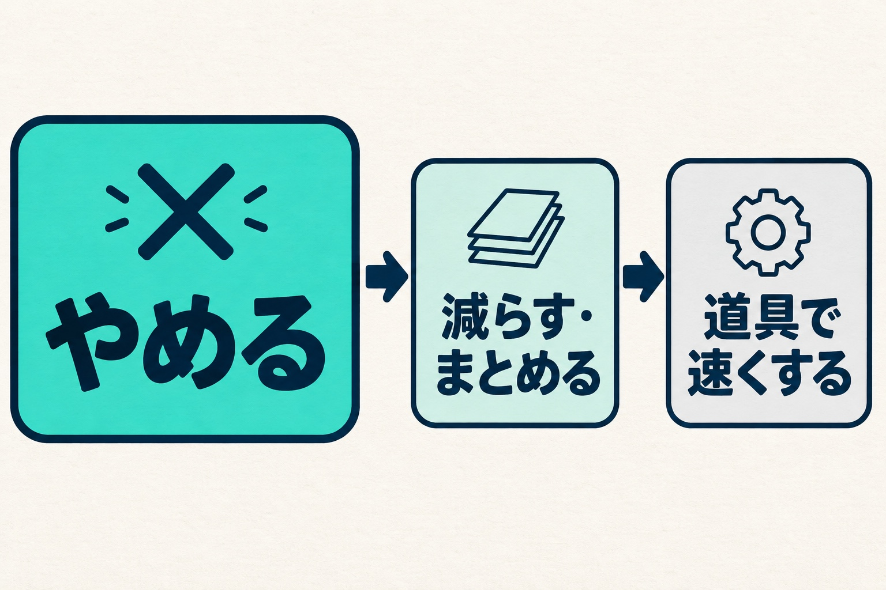
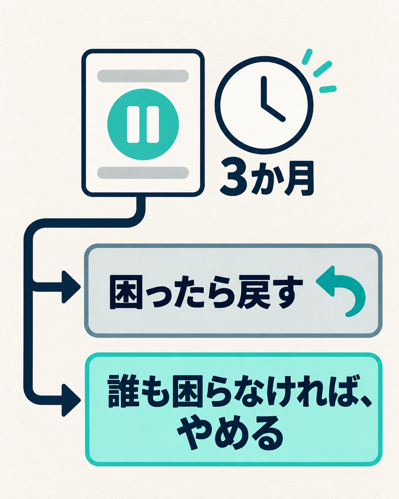

私たちの会社（HAMAYOUリゾート）は、山梨県の西湖でホテル、日帰り温泉、キャンプ場を営んでいます。私は常務をしています。

この夏、各部署が年度の目標に対してどこまで進んだかを報告してもらう「経過報告」を、年4回の形で始めました。その準備の途中で、現場の責任者から相談がありました。人が足りず勤務時間も延びていて、目標に手が回らないことが出てくる。どうしようもなく、解決の糸口が見つからないこともある、という内容でした。

旅館やホテルの人手不足は、うちに限った話ではないと思います。この記事では、この相談に会社としてどう答えたか、業務の見直しを始めるにあたって何を決めたか、そして始めて2か月の今どうなっているかを書きます。

## 人が足りる日は来ない、という前提に立った

最初に決めたのは、前提です。人が十分に足りる状態は、どの会社にもずっと来ない。そう考えることにしました。

求人は出していますし、採用を打ち手として否定するつもりもありません。ただ、採用には時間がかかりますし、人が増えればその分の経費も増えます。採れるかどうか分からない人を前提に計画を組むと、採れなかったときに全部が崩れます。

人が足りない前提に立つと、やることは一つに絞られます。今のサービスに対して人が足りないなら、人を増やす側ではなく、サービスの側を見直すしかありません。どこかで必ず「何をやめるか」を決める作業が要ります。

相談への返事でも、まずこう伝えました。「時間が足りない」という答えが出たこと自体が成果で、これまでのやり方が間違っていたということではない、と。

## 順番は「やめる → 減らす・まとめる → 道具で速くする」

業務の見直しには順番があると考えています。

1. やめる
2. 減らす・まとめる
3. 道具（AIを含む）で速くする

_まず「やめる」、次に「減らす・まとめる」、そのあとで「道具で速くする」の順に見直します。_

この順番を逆にすると、要らない作業を速くするという、いちばんもったいない結果になりかねません。道具の話は分かりやすく、前向きに聞こえるので、つい先に出したくなります。でも、そもそもその作業が要るのかを先に通さないと、手間をかけて無駄を磨くことになります。

正直に書くと、私自身もこの順番を守れていません。相談への返事では道具の話を混ぜないようにしていたのに、同じ時期に別のメッセージで、シフト作りにAIを使う案を出していました。現場の責任者も賛成してくれて、打ち合わせをすることになりました。順番が大事だと分かっていても、道具の話は先に出てしまう。だからこそ、順番を言葉にして手元に置いておくことにしています。

## 「廃止」ではなく、3か月の「試験停止」にした

人はなかなか業務をやめられません。やめて問題が起きたとき、その責任を取りたい人はいないからです。

そこで、やめる判断は「廃止」でなくてよい、としました。3か月止めてみて、困ることが出たら戻す。期限つきの試験停止です。3か月止めて誰も困らなかったものは、もともと要らなかったものだと考えられます。

_3か月の試験停止で、困ったら戻す。誰も困らなければ、やめると判断します。_

もう一つ、相談を受けて確かめたことがあります。オペレーションやサービスの細かい中身は、もともと現場の責任者の裁量で決められる状態でした。足りなかったのは権限ではなく、「使っていい」とはっきり言われていることでした。

ただ、権限があっても、失敗したときに自分だけが責められる構図なら、誰も今のやり方を変えません。そこで、次の3つをセットで伝えました。

- やめていい
- 止めて問題が出ても、判断ミスではなく検証の結果として扱う
- 責任は会社も一緒に持つ

お金が動くことと契約が絡むことだけは事前に相談してもらい、それ以外は現場で決めて、役員の会議で共有してもらう。境目もこのとき決めました。

「これまでのやり方に縛られなくていい」という言葉は正しいのですが、現場から見ると、自分たちが積み上げてきたものを否定されたように聞こえることがあります。「やめる判断の責任を現場だけに負わせない」とセットにしたのは、そのためです。

## 「時間が足りない」は答えではなく、症状

もう一つ気づいたことがあります。「時間が足りない」は、答えではなく症状だということです。

何に時間を取られているのかが分からないと、やめる対象を選べません。分からないままだと、結局「優先順位をつけて頑張る」に戻ってしまいます。

そこで、目標に届かない理由が人手や時間だった場合は、どの業務にどれくらい時間を取られているかも出してもらうことにしました。ただ、これは今のところ、一人分しか取れていません。ほかの部署からどう集めるかは、まだ決めていません。

## 拾った声は、必ず返す

8月末、第一回の経過報告が出そろいました。6部署すべてが期限内に出してくれました。前日に一度念を押しただけで、期限を過ぎて急かすことは一度もありませんでした。依頼から提出まで1週間ほどしかなかったことを思うと、ありがたいことです。

中身は、会社に「こうしてほしい」という要求よりも、忙しくてやりきれていない部分がある、という報告が中心でした。

役員の会議で、私が気になったのはここでした。ここまで真剣に報告してくれたのに、会社が読んで確認して終わりでは、一方通行に感じられるのではないか。

声を拾うときの決まりとして、拾った以上は必ず返すと決めています。「やります」でも「今はできません、理由はこれです」でもかまいません。いちばん良くないのは、何も返さないことです。一度それをやると、次から誰も本音を書かなくなります。

そこで、役員がそれぞれ部署ごとの報告を読んで感想を書き、9月の中ごろに全社へ共有しました。

## 2か月たって、試験停止はまだ0件

ここまで書いておいて何ですが、今のところ、試験停止にした業務はまだありません。

感想を返したあと、現場の受け止め方がどう変わったのかも、まだ分かりません。次の経過報告は11月末です。

人手不足への答えとして、「何をやめるか」は地味です。それでも、人が足りる日を待つより先に、足りない前提で回る形を探すほうが現実的だと思っています。試験停止の1件目が出たら、どうなったかをまた書きます。
