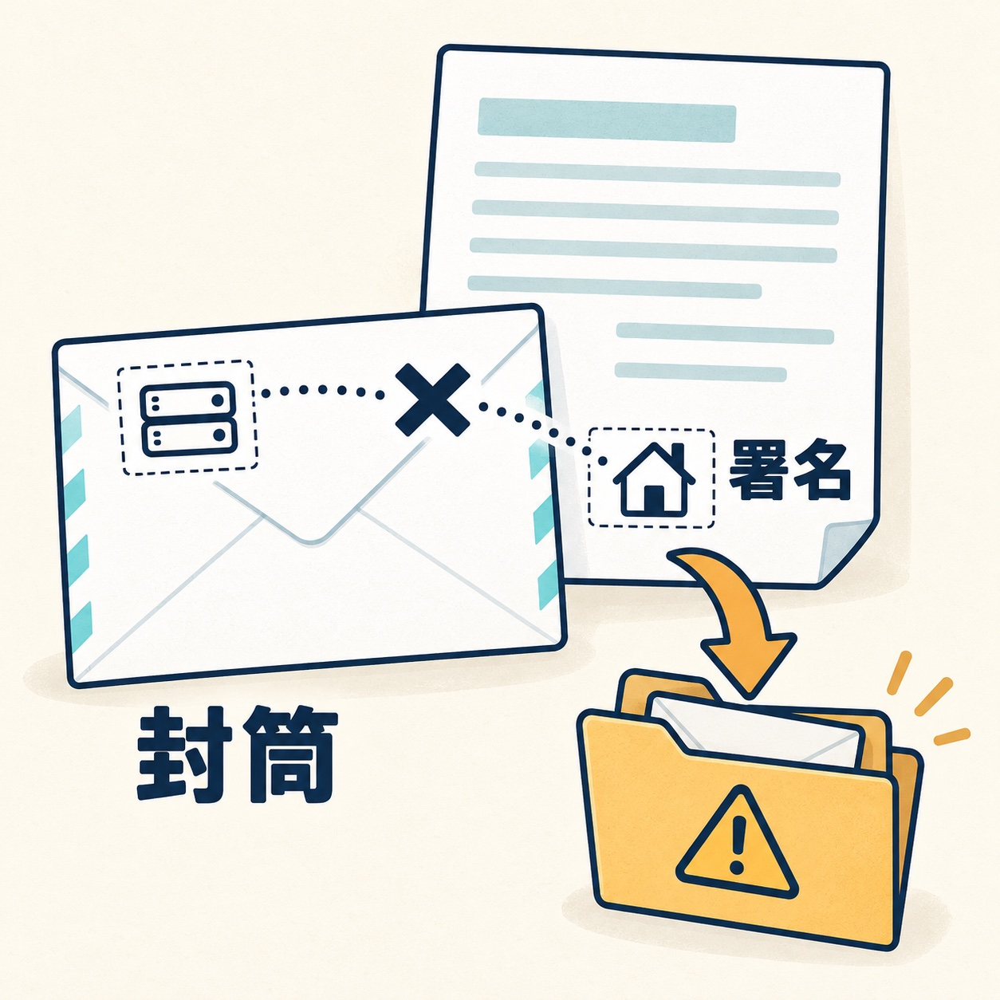
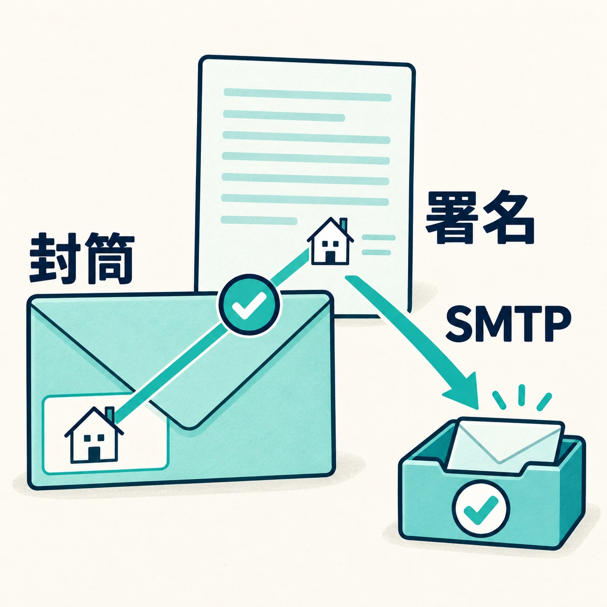

お問い合わせフォームの通知が、迷惑メールのフォルダに入っていた。受信箱に来るときと来ないときがある。フォームのメールで多い相談です。

8月、管理しているサイトがのっているサーバーの入れ替えがありました。その確認で、各サイトから試しのメールを1通ずつ送ったところ、ほとんどは受信箱に届いたのに、何通かが迷惑メールのフォルダに入りました。サイトもフォームも壊れていません。原因は、メールの送り方にありました。

この記事では、そのとき分かったことと、直し方をまとめます。

## まず、届いていないのか、迷惑メールに入っているのかを見る

フォームの通知が見当たらないときは、最初に迷惑メールのフォルダを見てください。届いていないように見えて、実は迷惑メールに入っていることがよくあります。

なお、フォームの「送信できました」は、サイトがメールを送り出したところまでがうまくいった、という意味です。その先で相手の受信箱に入ったか、迷惑メールに回されたかは、フォームには分かりません。送った人に届く控えのメール（自動返信）も、持ち主宛ての通知とは別の1通です。持ち主の受信箱で見るまでは、届いたかどうかは分かりません。

## 迷惑メールに入った原因：差出人が2か所あり、そろっていなかった

迷惑メールに入ったメールの詳しい情報を開くと、理由が書いてありました。

メールには、差出人が2か所に書かれています。手紙でいえば、**封筒に書く差出人**と、**便箋の最後に書く署名**です。

- 封筒の差出人：実際にメールを送ったサーバーのアカウント
- 便箋の署名：サイトのドメインのアドレス（「wordpress@サイトのドメイン」のような形）

_封筒の差出人と便箋の署名がそろっていないと、迷惑メールに回されることがあります。_

このときのサーバーでは、WordPressが標準のやり方でメールを送ると、この2つが一致していませんでした。封筒にはサーバー会社のアカウント、署名にはサイトの名前。受け取る側から見ると、「名乗っている送り主と、実際に出した人が違う手紙」です。共用のレンタルサーバーでは、よくある形です。

そこへ、サイトのドメインの側で「わたしの名前を名乗っていて、送り主が合わないメールは隔離してください」という宣言（DMARCと呼ばれる設定）がされていると、受け取る側はそのとおりに迷惑メールへ回します。迷惑メールに入ったうちのほとんどは、この宣言をしているドメインのサイトでした（残る1通は宣言の無いドメインで、受け取る側が自分の判断で迷惑メールに回したものでした）。

送り主を確かめる仕組みのうち、封筒の差出人を確かめるもの（SPF）は合格していました。サーバーのアカウントから出したメールとしては、正しいからです。引っかかったのは、封筒と署名がそろっているかを見る確認でした。「サーバーの設定は合っているのに迷惑メールに入る」のは、こういうときです。

## 決め手は、同じ宣言をしている別のサイトだった

原因がはっきりしたのは、同じ宣言をしている別のサイトがあったからです。

そのサイトは、本番のサイトが受信箱に届き、試験用のサイトだけが迷惑メールに入りました。宣言はどちらも同じです。違ったのは送り方で、本番だけが、次の章で書く「SMTP」という送り方に切り替えてありました。条件が同じで送り方だけが違い、結果が分かれたので、送り方が原因だと言い切れました。

## SMTPで送ると、ちぐはぐが消える

SMTPで送るというのは、サーバーに任せて送るのをやめ、サイトのドメインで作った送信専用のメールアドレスにログインして、そのアドレスから送る、ということです。封筒の差出人と便箋の署名が同じサイトの名前になり、送り主を確かめる仕組みにも通るようになります。

_サイトのドメインのアドレスからSMTPで送ると、封筒の差出人と便箋の署名がそろい、受信箱に届きやすくなります。_

サイトの持ち主には、フォームを入れてから、問い合わせが持ち主のもとにメールとして届くまでの流れを、図にして説明しました。流れのどこがちぐはぐになっているかを見せて、SMTPを使うとそこがそろってすっきりすること、その結果、メールが届きやすくなり、はじかれにくくなることを伝えました。メールの仕組みの言葉を並べるより、1枚の図で「ここが合っていない」と指さすほうが伝わります。

これをきっかけに、新しく作るサイトには、フォームのメールをSMTPで送る仕組みを最初から入れることにしました。すでにあるサイトに後から入れる場合は、サイトのドメインのメールアドレスを1つ増やすことになります。持ち主のメールの契約に関わるので、了承をもらってから進めます。

## 宣言を緩めるのではなく、送り方を直す

ドメイン側の「隔離してください」という宣言を緩めれば、迷惑メールには入らなくなります。手っ取り早く見えますが、これは他人がそのドメインを名乗ってメールを送る「なりすまし」を防ぐための設定です。

宣言そのものは正しい設定なので、緩めるのではなく、送り方のほうを正しくします。

## 設定の初期値が残っていて届かないこともある

送り方とは別に、そもそも宛先が違っていて届かないこともあります。

今回の確認の途中で、あるサイトのフォームの通知先・差出人・件名が、サイトを作るときに使った雛形の初期値のまま残っているのを見つけました。ただ、これはフォームを作ったあと「やっぱり今は要らない」となって、そのままになっていたページでした。サイトのどこからもリンクされておらず、持ち主にも「使っていない」と確かめられたので、ページごと片付けました。

フォームを作ったら、普通は最初に1通送ってみるので、使っているフォームでこれが起きることはまずありません。気をつけたいのは、作りかけのまま残っているページです。使わないフォームのページは公開しないでおくと、こうした取り違えも起きません。

## 自分で確かめる順番

フォームのメールが届かない、迷惑メールに入るときは、次の順番で確かめてください。

1. **迷惑メールのフォルダを見る**。受信箱に無ければ、まずここです
2. **自分でフォームから送ってみる**。控えではなく、持ち主宛ての通知が届くかを見ます
3. **届いた通知メールの詳しい情報を見る**。メールソフトで「ソースを表示」などを開くと、SPF・DKIM・DMARCという3つの確認の結果が「pass（合格）」か「fail（不合格）」で書いてあります。DMARCがfailなら、送り方がちぐはぐです
4. **フォームの設定画面で、通知先と差出人を見る**。差出人がサイトのドメインと違うアドレスになっていないか

1と2は、持ち主が自分でできます。3から先が分からなければ、サイトを作った人や管理している人に見てもらってください。

スパム対策でフォームに手を入れたあとも、同じように送ってみるのが大切です。対策で本物の問い合わせまで止まっていないかは、送ってみないと分かりません。スパムの止め方は「[お問い合わせフォームにスパムが急増したら](/blog/wordpress-contact-form-spam)」にまとめています。

## まとめ

フォームの通知が届かないとき、多くは迷惑メールのフォルダに入っています。そして迷惑メールに入る原因は、サイトやフォームではなく、メールの送り方にあることがあります。

- メールの差出人は、封筒（実際に送ったサーバー）と署名（サイトのドメイン）の2か所にある
- 共用のレンタルサーバーで標準の送り方のままだと、2つがそろわず、ドメインの宣言によっては迷惑メールに回される
- SMTPで、サイトのドメインのアドレスから送ると、ちぐはぐが消えて届きやすくなる
- 宣言を緩めるのではなく、送り方を直す
- 確かめるには、迷惑メールのフォルダを見て、自分で送って、メールの詳しい情報でDMARCの結果を見る

サイトをhttpsに切り替えたあとも、フォームと自動返信のメールは必ず試してください。切り替えのときに確かめることは「[常時SSL化の注意点](/blog/always-on-ssl-checklist)」に書いています。サイト全体の守り方は「[WordPressセキュリティ対策ガイド](/blog/wordpress-security-measures)」にまとめています。
