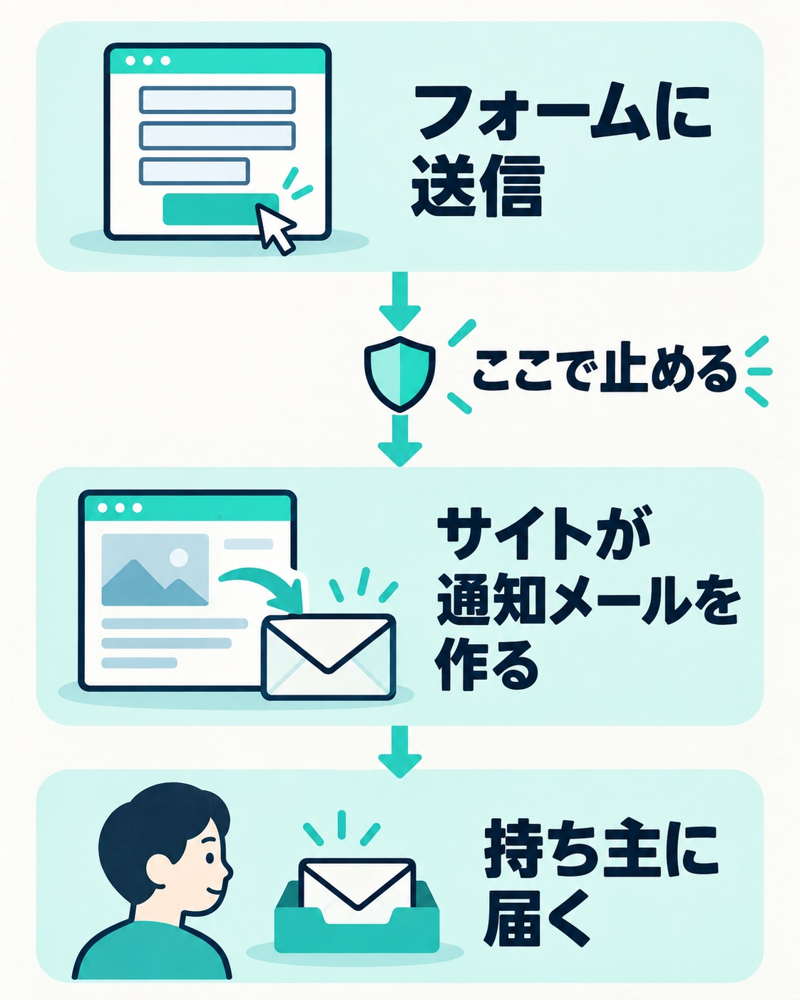

お問い合わせフォームに、英語の問い合わせが毎日のように届く。最初は数件で、消せば済んでいた。ところがある日、届く数が急に何倍にも増えて、本物の問い合わせが埋もれてしまう。そうなると、もう業務に差し支えます。

今回の例は、ある団体のWordPressサイトです。春ごろから海外のスパムがフォームに届くようになり、ある日いきなり急増しました。サイトの持ち主から、間に入っているディレクター経由で「有効な対策を提案してほしい」と相談を受け、その日のうちに対策を入れました。

この記事では、そのときに確かめたことと、打った手を順番にまとめます。

## メールの迷惑メール設定では、なぜ止まらないのか

フォームのスパムが増えると、まず「メールソフトの迷惑メール設定を強くすれば止まるのでは」と考えがちです。ところが、これでは止まりません。

フォームから届くメールは、スパムを送った相手から直接届いているわけではありません。誰かがフォームに入力して送信すると、その内容を**サイト自身が**通知メールにして、持ち主のアドレスへ送っています。差出人はサイトのアドレスで、文面もサイトが決めた形のままです。

_サイトが通知メールを作って持ち主に届けます。止めるなら、フォームが送信を受け付ける手前です。_

つまり、メール側から見ると、スパムも本物の問い合わせも「自分のサイトが送ってきた、いつもの通知メール」です。見分けるための手がかりがないので、メール側の設定を強くしても止められません。強くしすぎれば、本物の問い合わせまで迷惑メールに入ってしまいます。

止めるなら、フォームが送信を受け付ける手前、つまりサイトの側です。持ち主の方にも、この筋で説明しました。

## まず、スパムがどこから来ているかを見る

対策を決める前に、届いたスパムをよく見ました。手がかりになったのは、お問い合わせの種類を選ぶ項目です。

この項目は、いくつかの選択肢からチェックで選ぶ形でした。ところが、届いたメールのその欄には、選択肢にない英文がそのまま入っていました。画面から送ったなら、選択肢以外の言葉が入ることはありません。

ここから分かるのは、スパムを送っている側がフォームの画面を開いていない、ということです。フォームの送信先に、データを直接送りつけています。そうなると、入力の確認画面も、画面に組み込んだ仕掛けも、すべて素通りされます。「確認画面があるから大丈夫」は通用しません。

もう一つ、通知メールに送信元の情報を載せる設定を足しました。WordPressのフォームでは、通知メールの文面に、送信元のIPアドレスとブラウザの情報を差し込めることが多いです。これを載せておくと、届いたスパムが国内から来ているのか、国外から来ているのかを、あとから確かめられます。

## 「入っているはず」の迷惑送信対策を確かめる

フォームの下には、迷惑な送信を見分ける仕組みが入っていることを示す一文が表示されていました。それなのにスパムが届いている。調べると、仕組みの設定が外れていて、表示の文言だけが残っている状態でした。

設定し直したうえで、気をつけたことがあります。この手の仕組みは、ページを開いたときに発行する「通行証」のようなものに有効期限があります。確認画面のあるフォームでは、入力から送信までに時間がかかると、本物の問い合わせまで弾かれることがあります。もともと設定が外れていたのも、確認画面とうまく噛み合わなかったことが原因かもしれません。

だからこそ、設定し直したあとは、確認画面から送信までを実際に試して、本物の問い合わせが届くことを確かめました。

## 国外からのアクセスを止める前に、確かめる2つのこと

今回の効き目が一番大きかったのは、国外からのアクセスを止める設定です。レンタルサーバーの管理画面に、国外からのアクセスを止める機能があるところは少なくありません。今回のサーバーでは、フォームの送信先もその対象に含まれていたので、画面を使わずに直接送りつけてくる手口に、ちょうど噛み合いました。ログイン画面も一緒に守られます。

ただし、入れる前に持ち主と確かめることが2つあります。

1. **海外から、本物の問い合わせが来るサイトか**。海外のお客さんや取引先がいるなら、その人たちの問い合わせも届かなくなります。
2. **持ち主が海外にいるとき、管理画面に入れなくなってもよいか**。出張や旅行先から更新することがあるなら、困ることになります。

_海外から本物の問い合わせが来るか、海外で管理画面を使うかを、設定を入れる前に確かめます。_

どちらかに当てはまるサイトには、この設定は入れない方がいいです。その場合は、本文に日本語を含まない送信を受け付けない、といったフォーム側の対策を考えます。

今回は打ち合わせの当日に設定を入れました。そのあと、国内から送信して、本物の問い合わせが届くことも確かめています。

## 対策のあとに、必ず試すこと

スパム対策で一番避けたいのは、スパムは止まったのに、本物の問い合わせまで止まっていた、という状態です。持ち主は届かないことに気づけないので、問い合わせを取りこぼしたまま時間が過ぎます。

対策を入れたら、少なくとも次は試してください。

- 国内から、フォームの入力から送信まで（確認画面があるなら確認画面も）を一通り通す
- 通知メールが持ち主に届き、迷惑メールのフォルダに入っていないか
- 問い合わせた人への自動返信が届くか

今回は、本物の送信が通ることを確かめたうえで様子を見ることにしました。そのあと、ディレクターからスパムの件で相談が来ることはありませんでした。

## 古いフォームのままなら、作り替えも選択肢に

今回は当日に入れられる対策で業務の支障を止めましたが、根本の原因はフォームの仕組みが古いままだったことです。古い仕組みは、選択式の項目に選択肢以外の値が入っても、そのまま受け付けてしまうことがあります。確認画面を後付けで足していると、仕組みを新しくした途端に確認画面が動かなくなる、ということも起こります。

急ぎの対策で落ち着いたら、確認画面を残すかどうかも含めて、フォームの作り替えを検討してください。WordPress本体やプラグインの更新を止めているサイトなら、更新の進め方は「[WordPressのバージョンアップは、サイトを止めずにできる](/blog/wordpress-version-up)」に、サイト全体の守り方は「[WordPressセキュリティ対策ガイド](/blog/wordpress-security-measures)」にまとめています。

## まとめ

お問い合わせフォームのスパムは、メール側では止められません。届くのはサイト自身が送る通知メールだからです。止めるのはフォームの側です。

- 届いたスパムをよく見て、画面を使わずに直接送られていないかを確かめる
- 通知メールに送信元の情報を載せ、国内か国外かを確かめられるようにする
- 迷惑送信を見分ける仕組みが、表示だけ残って外れていないかを確かめる
- 国外からのアクセスを止める前に、海外からの問い合わせと、海外での管理画面の利用を持ち主と確かめる
- 対策のあとは、本物の問い合わせが届くことを必ず試す
