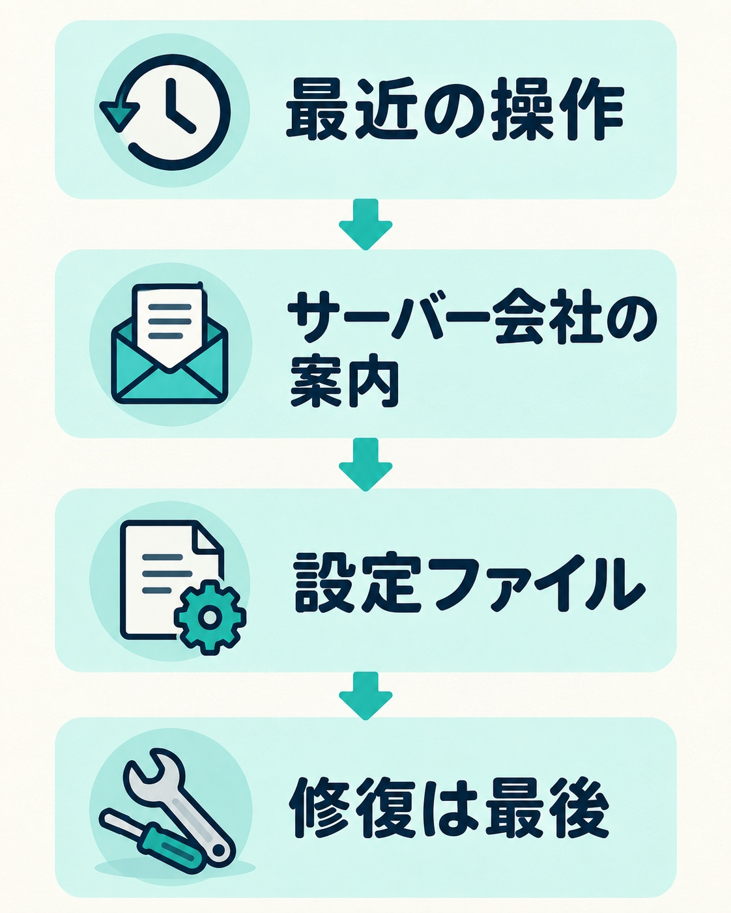
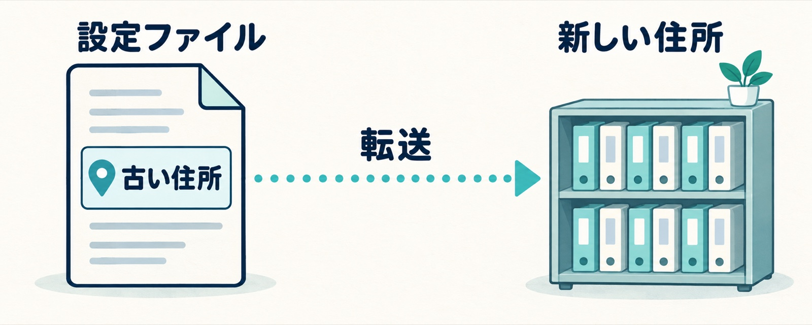

WordPressのサイトを開いたら、真っ白な画面に「データベース接続確立エラー」（英語なら「Error establishing a database connection」）とだけ出ている。この画面を見ると、サイトが壊れた、記事が全部消えたのではないかと不安になります。

先にお伝えすると、このエラーは「データが消えた」という意味ではありません。この記事では、エラーの意味、確かめる順番、サーバー会社からデータベースサーバーの入れ替えの案内が来たときに気をつけることを、私が保守で対応した例も交えてまとめます。

## このエラーが意味すること

WordPressは、記事や設定をデータベースという保管庫に置いています。ページを表示するたびに、WordPressはこの保管庫へ中身を取りに行きます。

「データベース接続確立エラー」は、その取りに行く途中でつながらなかった、という意味です。保管庫の中身が消えたことを示すものではありません。つながらない理由を見つけて直せば、記事や設定はそのまま戻ってきます。

ここで避けたいのは、原因が分からないうちに手当たり次第に触ることです。触ったことで、今より悪くなることがあります。何かを直す前に、今のファイルとデータベースの写し（バックアップ）を取っておきましょう。サーバーの管理画面にバックアップの機能があれば、それを使えば十分です。

## まず「最近何をしたか」を思い出す

サイトの持ち主から「データベース接続エラーと出た」と連絡をもらったとき、私が最初に聞くのは「最近何かやったことはありますか。覚えている範囲で大丈夫です」です。

たとえば、次のようなことです。

- プラグインやテーマを更新した
- 設定ファイルを書き換えた
- サーバーを引っ越した
- サーバー会社からメンテナンスの案内が来ていた

_原因を決めつけず、最近の操作とサーバー会社の案内から順に確かめます。修復は最後の手段です。_

ただ、これは当たりをつけるために聞いているだけです。実際には、こちらでサーバーのログや設定を見た方が早い部分もあります。思い出せなくても大丈夫です。

思い当たることが無いときは、メールを見てみてください。契約しているサーバー会社から「メンテナンス」「入れ替え」「リプレース」「障害」といった件名のお知らせが来ていないか。持ち主ができるのは、そこまでで十分です。

## サーバー会社の「データベースサーバー入れ替え」で起きること

自分では何もしていないのに、このエラーが出ることがあります。そのきっかけの一つが、サーバー会社のメンテナンスです。

WordPressは、設定ファイル（wp-config.php）に書かれた「データベースの住所」（ホスト名）を見て、保管庫へつなぎに行きます。サーバー会社がデータベースサーバーを入れ替えると、この住所が変わることがあります。古い住所のまま残っていると、どこかの時点でつながらなくなるおそれがあります。

_サーバーの入れ替え後、古い住所から転送されて動く場合でも、転送がいつまで続くかは分かりません。_

案内のメールに「データベース」「MySQL」「ホスト名」「収容サーバー」「入れ替え」「リプレース」とあれば、自分のサイトに関係があるかもしれません。「変更前」「変更後」として新しいホスト名が書かれていたら、特に注意が必要です。

### 私が保守で対応した例

今年の夏、保守で預かっている複数のサイトが載っているサーバーで、サーバー会社からデータベースサーバーの入れ替えの案内が届きました。作業のあいだはデータベースが読み込み専用になり、サイトの表示はできるが更新はできない、という内容です。

困ったのは、案内の読み方でした。「設定ファイルの修正は不要」と書かれている一方で、「ご自身で導入したCMSの設定は変更されない」とも読める書き方があり、うちのサイトがどちらに当たるのかが分かりませんでした。サーバー会社に問い合わせましたが、入れ替えの日までに回答は来ませんでした。

そこで、入れ替えが終わったあと、全サイトの設定ファイルの接続先を、新しいデータベースサーバーの名前に書き換えました。古い名前のままでも当面は転送されて動きます。ただ、その転送がいつまで続くかは分かりません。新しい名前を直接書いておけば、転送が続いても終わっても、今より悪くなることはない、という判断です。

書き換えたあと、全サイトで表示と接続を確かめ、接続エラーは1件も出ませんでした。後日サーバー会社から届いた回答は、「古い名前は現時点では使えるが、今後の提供は確約できない」「新しい名前の利用をすすめる」というものでした。

案内メールの「修正は不要」は、多くの場合はそのとおりです。ただ、自分のサイトがそれに当てはまるかは、読んだだけでは分からないこともあります。入れ替えの案内が来たら読み流さず、設定ファイルの接続先に関係するかを確かめてください。分からなければ、サーバー会社に聞くか、詳しい人に見てもらうのが確実です。

## 設定ファイルの接続情報を確かめる

最近の操作やサーバー側の案内に心当たりがなければ、設定ファイル（wp-config.php）に書かれた接続情報を確かめます。見るのは、データベース名・ユーザー名・パスワード・ホスト名の4つです。

照らし合わせる先は、契約しているサーバーの管理画面にあるデータベースの項目です。パスワードは管理画面で見られないことが多いので、分からなければ再設定になります。サーバー側でパスワードを変えたら、同じ値をすぐ設定ファイルに書いてください。変えてから書くまでのあいだは、サイトが表示されません。同じデータベースを使っている別のサイトや仕組みがあれば、そちらも書き換えが必要です。

設定ファイルを編集するときは、次の2つだけ気をつけてください。

- 編集する前に、元のファイルを別名で保存しておく（いつでも戻せるように）
- 値を囲んでいる引用符（' '）を消さない。余計な空白や全角文字を入れない

## サーバーが混み合っている場合

「表示されたり、されなかったりする」「数分おいて再読み込みすると直る」という場合は、サーバーが一時的に混み合っていることがあります。設定の間違いなら、何度開いても同じエラーが出るはずです。

このときは、少し時間をおいてから再読み込みしてみてください。サーバー会社の障害・メンテナンス情報のページも確かめます。それでも続くようなら、サーバー会社に問い合わせましょう。

## 最後の手段：データベースの修復

WordPressには、データベースを修復する機能があります。設定ファイルに1行（`define('WP_ALLOW_REPAIR', true);`）を書き足すと、修復の画面が開けるようになります。

ただし、これは最後の手段です。使ってよいのは、次の3つがそろっているときだけにしてください。

- 設定ファイルの接続情報が正しいと確かめられている
- サーバー会社の障害でもない
- エラー画面に「データベースの修復が必要」といった表示が出ている

使う前には、データベースのバックアップを取ります。修復が終わったら、書き足した1行は必ず消してください。残したままにすると、誰でも修復の画面を開けてしまいます。少しでも不安があれば、自分で進めずに相談した方が安全です。

## 自分で直すのが不安なときは

次のようなときは、無理に粘らない方がよいと思います。

- 設定ファイルを開いても、どれが正しい値なのか分からない
- ファイルを触るのが怖い
- 最近何もしていないのに、急にエラーが出た

相談するときに、準備は要りません。私が聞くのは「最近何かやったことはあるか。覚えている範囲で」だけで、思い出せなくても大丈夫です。ログや設定はこちらで見ます。

画面が真っ白になる、ログインできないといった、ほかのトラブルについては次の記事にまとめています。

- [WordPressが真っ白になったときの直し方](/blog/wordpress-white-screen-recovery)
- [WordPressにログインできないときの対処](/blog/wordpress-cannot-login)
