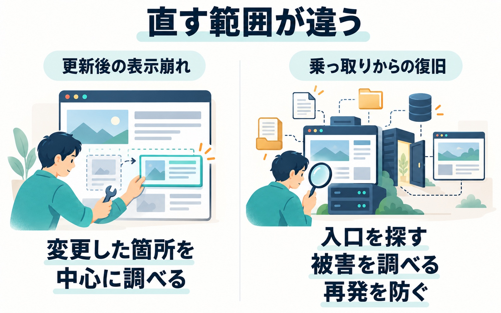

「WordPressのパスワードが変更されました」という身に覚えのないメールが届いた。管理画面に入れない。ページの端に見慣れない文字が出ている。

WordPressの乗っ取りは、こうした小さな異変から見つかります。一方で、見た目はいつもどおりのまま、裏で何週間も使われ続けていることもあります。

この記事では、私が実際に対応した2件の乗っ取りをもとに、気づくための兆候、入られた原因、気づいたときに最初にやること、やってはいけないこと、そして再発を防ぐ対策をまとめます。

## 乗っ取りの兆候：分かりやすいものと、気づきにくいもの

### 分かりやすい兆候

1件目は、朝「WordPressのパスワードが変更されました」という通知メールが届き、担当者がログインできなくなったケースでした。サイトを開くと、ページの上の方に文字化けしたような不審な文字列が出ていました。

調べると、正規のプラグインを装った不正なプログラムが仕込まれていました。外から操作するための「裏口」です。文字化けの正体は、この裏口が出していた文字でした。

- 自分で変えた覚えのないパスワード変更の通知が届いた
- 管理画面にログインできなくなった（→ [WordPressにログインできないときの原因と対処](/blog/wordpress-cannot-login)）
- ページの上や下に、見慣れない文字や記号が出ている
- ユーザーの一覧に、知らない管理者が増えている

小さく見えても、どれも見逃さないでください。

### 気づきにくい兆候

2件目は、もっと気づきにくいケースでした。人がサイトを見ると普段どおり表示されるのに、検索エンジンのロボットにだけ、通販サイト風の偽ページを大量に返す仕掛けが入っていました。持ち主が見ても異変は見えません。別の用件でサーバーを調べていて、初めて分かりました。

裏口のファイルは、数週間にわたって少しずつ増えていました。最初に入られてから気づくまで、かなり時間がたっていたことになります。

- 検索結果に、身に覚えのないページ（通販や海外の商品など）が出ている
- サーバーへのアクセスが、理由なく急に増えた
- Googleの検索結果やSearch Consoleに、ハッキングの警告が出ている

_持ち主が見て異変がなくても、検索エンジンにだけ別の内容を返している場合があります。_

### サーバーの中で見つかった裏口の特徴

FTPなどでサーバーの中を見られる方向けに、実際に見つかった裏口の特徴も挙げておきます。

- 自分で入れた覚えのないプラグインのフォルダがある。「キャッシュ」「最適化」「設定」のような、正規の機能らしい英単語に、意味のない英数字がついた名前が多い
- 名前が「.」で始まる隠しフォルダの中に、PHPファイルが置かれている
- 更新した覚えのない日に、ファイルが作られたり書き換えられたりしている
- サイトの入口になるファイルの先頭に、見慣れない行が足されている

ただし、**見つけても、その場で消さないでください。**理由は後の「やってはいけないこと」で書きます。ファイル名と日付を控えておくところまでにしてください。

## 入口は「更新が止まったWordPress本体」だった

私が対応した2件は、どちらも入口がWordPress本体の更新が止まっていたことでした。パスワードが弱かったわけでも、プラグインの弱点でもありません。

1件目は、数日分のアクセスログを秒単位で追いました。ログイン画面への総当たりは一度も成功していません。攻撃者はWordPress本体にあった欠陥を突いて管理者のパスワードを書き換え、その新しいパスワードで、普通にログインしていました。

この欠陥を直した版は、被害のちょうど1週間前に公開されていました。ところがそのサイトは自動更新を止めていたので、古い版のまま動いていました。

2件目も同じで、本体の欠陥を狙った攻撃の記録が残っていました。そのサイトも、本体の自動更新が設定で止められていました。

### 自動更新は「いつの間にか止まっている」

自動更新を止める理由は、たいてい「更新で表示が崩れるのが怖い」です。サイトを作る側が、表示が崩れないよう自動更新を止めた状態で納品することも珍しくありません。

その後は誰かが手で更新する前提だったはずが、担当が変わったり忙しかったりで、何年もそのままになります。2件目のサイトも、更新を止める設定は何年も前から入っていて、誰がどういう理由で入れたのかは、もう分からない状態でした。

「自分は止めた覚えがない」という方も、管理画面の「更新」の画面で、今のバージョンと自動更新が有効かどうかを一度確かめてください。制作会社に作ってもらったサイトなら、「自動更新は止まっていますか」と聞くだけでも十分です。

なお、どちらのサイトにも、ログイン画面や外部連携用の窓口へのパスワード総当たりは毎日大量に来ていました。今回の入口ではありませんでしたが、弱いパスワードや、サーバーの防御設定がオフのままの状態は、次の入口になり得ます。

## 放置するとどうなるか

偽ページの件では、調べた1週間だけで、偽ページへのアクセスが250万回を超えていました。検索エンジンのロボットには、100万件を超える偽ページが「このサイトのページ」として見せられていたことになります。サイトの名前が、別の何かの宣伝に使われていたわけです。

しかもその仕掛けは、ページが表示されるたびに外部から命令を取ってきて実行する作りでした。攻撃者が命令を差し替えれば、いつでも別のことができた状態です。表向きは検索向けのスパムだけに見えても、それ以上のことをしていなかったとは言い切れません。

一般的には、次のような被害も起こり得ます。

- 訪問者の端末に、不正なプログラムを配るページにされる
- 他のサイトを攻撃するための踏み台にされる
- 検索結果に警告が出たり、検索結果から外されたりする

## 気づいたら最初にやること

### 1. サイトを止めて、自分以外が触れない状態にする

私は以前、あやしいファイルを手で消したのに、すぐにまた作られてしまったことがあります。そのとき、「自分が何か操作することで、今より悪化するかもしれない」と感じました。直している途中でどんどん悪くなっていっては困ります。

だから1件目のときは、気づいてすぐ、迷わずサイトを止めました。サイト全体をメンテナンス表示にして作業者だけが通れるようにし、自分以外が触れない状態にしてから調べ始めました。

持ち主には、間に入っていたディレクターから「原因を分析する間、メンテナンスにさせてもらう」と簡単に説明してもらい、それで納得してもらえました。止めることに、長い説明は要りません。

### 2. パスワードを、外側から内側の順に全部変える

変える順番は、外側から内側です。

1. レンタルサーバーの管理画面
2. FTP
3. データベース
4. WordPressの全ユーザー

この件では、WordPressには入れなくても、サーバーの管理画面とFTPには入れました。「サーバーはまだこちらの手にある」と分かり、そこを足がかりにできました。まずは、どこまで自分の手が届くかを確かめてください。

### 3. 認証キーを作り直す

最後に、WordPressの「認証キー」も作り直します。

認証キーは、一度ログインした人に渡している入館証のようなものです。パスワード（玄関の鍵）を変えても、すでに入館証を持って中にいる人は、そのまま居続けられます。認証キーを作り直すと配った入館証が全部使えなくなり、持ち主も含めて全員が一度追い出されます。そのあと、新しいパスワードで入り直す形です。

### やってはいけないこと

**あやしいファイルを見つけても、その場で消さないでください。**別の場所に裏口が残っていると、消しても消しても戻ってきます。慌てていろいろな設定を触るのも同じで、状況を悪化させたり、原因を調べる手がかりを消してしまったりします。

## 自分でできる範囲と、任せた方がいい境目

自分でできるのは、基本的に「きれいなバックアップからの復元」までです。

ただ、そのバックアップが本当にきれいかを確かめるのが難しく、手間もかかります。裏口は、気づかれないまま何週間も前から置かれていることがあります。「先月のバックアップなら大丈夫」とは言えません。

きれいなバックアップが無ければ、きれいなWordPress本体を用意して、そこに本番サイトの中身を盛り込み直すことになります。これはかなり大変でした。

次のどれかに当てはまったら、自分で進めるのはやめて、任せることを考えてください。

- 消したのに、また作られた
- 何をされたのかが分からない
- バックアップがきれいか、確かめようがない

## 費用の話：崩れた表示と乗っ取りでは、桁が違う

自動更新を止めておきたい方には、私はいつもお金の話をします。

更新で表示が崩れた場合は、原因の当たりがつきやすいのが特徴です。バージョンアップで変わった部分を見れば、どこが原因か見当がつきます。見た目の崩れならデザインの指定（CSS）を整えれば済みますし、表示されない場合も、PHPの機能が使えなくなった・プラグインが絡んでいるなど、調べる範囲が決まっています。

乗っ取りは、そうはいきません。何をされ、どこがどういう状態で、それをどう直すかを、手がかりの少ないところから考えることになります。アクセスログを追って入口を特定し、裏口を残らず探し、同じサーバーの他のサイトが汚されていないかも確かめ、入口を塞いで、何が起きていたかを報告する。必要な工程がまるで違います。

_乗っ取りでは、表示を戻すだけでなく、入口・被害の範囲・再発防止まで調べます。_

だから持ち主の方には、「更新で崩れた表示なら1万・2万円で直せるものが、乗っ取られると30万・40万円かかるリスクがある」と説明しています。仮に崩れても、崩れた方を直す方が早い。これが結論です。

### 頼む先を選ぶときに見る2点

- 入口の特定と、再発防止までやるか（不正なファイルを消すだけでは、同じ入口からまた入られます）
- 何が起きていたかを、報告してくれるか

費用は被害の状況で大きく変わるので、まず状況を確認してもらい、見積もりを見てから決めるのが基本です。

## 再発を防ぐために、今日からできる対策

### 1. 自動更新を止めない（最優先）

2件とも、直した版はすでに出ていました。古いままだったところを突かれています。止めるなら、誰かが定期的に更新することが条件です。

### 2. サーバーのWAFを有効にする

WAFは、不正な通信を防ぐ機能です。多くのレンタルサーバーでは、管理画面でオンにするだけで使えます。1件目でも、再発防止として有効にしました。

### 3. 使っていない入口を閉じる

1件目では、実際に使われた入口と、パスワード総当たりの入口になっていた外部連携用の窓口を、個別に閉じました。

### 4. ログインに使うユーザー名を外から分からないようにする

サイトのURLに少し手を加えるだけで、ログインに使うユーザー名が外から分かってしまう状態のサイトがあります。ユーザー名が分かると、攻撃者はパスワードを当てるだけで済みます。1件目では、ここも塞ぎました。

### 5. パスワードを強くし、二段階認証を使う

推測されやすいユーザー名や短いパスワードは、総当たりの入口になります。

なお、ログインURLを変更する対策もよく紹介されますが、今回の2件はどちらもログイン画面を通らずに本体の欠陥から入られていました。ログインURLを変えていても防げなかった入り方です。総当たりを減らす補助的な対策と考えてください。

対策の全体は、[WordPressのセキュリティ対策](/blog/wordpress-security-measures)の記事にまとめています。

## バックアップは「日付ごとに」残す

バックアップがあっても、それがきれいかどうかを確かめるのに手間がかかります。いつの時点のものか分かるように、日付ごとに残しておくと、いざというときに比べやすくなります。

一般には、サーバーの中だけでなく、パソコンやクラウドなど別の場所にも保存しておくと安心です。サーバーごと被害を受けたときに、一緒に失うのを防げます。

## 検索結果の後始末には時間がかかる

サイトの中をきれいにすることと、検索結果が元に戻ることは、別の話です。後者には時間がかかります。

偽ページが検索結果に残っている場合は、Googleの Search Console で警告の有無を確かめ、対処が終わったら審査をやり直してもらう手続き（再審査リクエスト）を出すのが一般的な流れです。

## まとめ

- 更新を止めない。止めるなら止めるでもいい。ただ、乗っ取られたときの手間と費用は、崩れた表示を直すのとは桁が違います
- 気づいたら、まずサイトを止めて、触らない。あやしいファイルもその場では消さない
