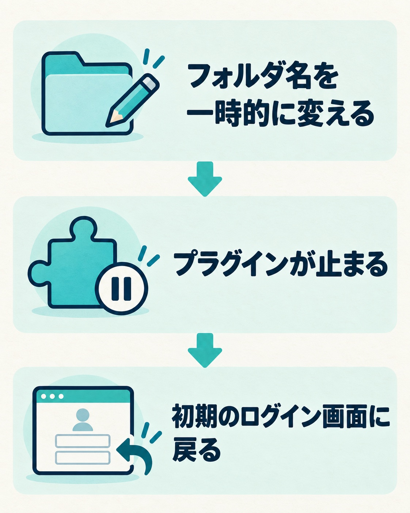
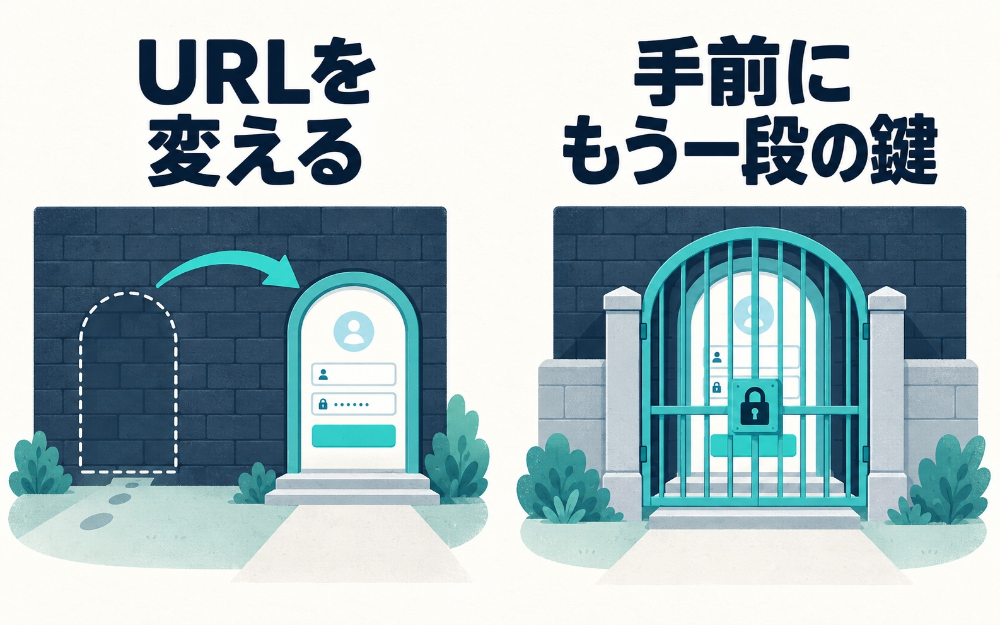
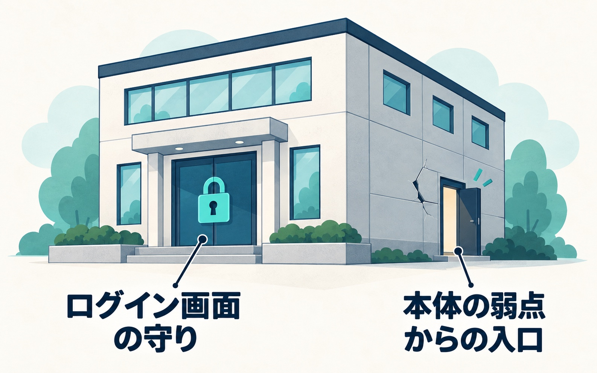

WordPressのセキュリティ対策を調べると、「ログインURLを変更しましょう」という話がよく出てきます。初期のままのログイン画面は、どのサイトでも同じ場所にあるからです。

URLを変えるのは、ログイン画面を守る方法の一つです。一方で、私がWordPressの保守や復旧でログイン画面を守るときは、URLは変えずに、ログイン画面の手前にもう一段のIDとパスワード（Basic認証）をかけています。

この記事では、ログインURLを変える目的と方法、変えたあとに気をつけること、忘れたときの戻し方をまとめます。そのうえで、私がBasic認証を選んでいる理由と、ログイン画面を守るだけでは防げないことも書きます。

## ログインURLを変える目的

WordPressのログイン画面は、何も設定しなければ、どのサイトでも同じ場所にあります。サイトのアドレスの後ろに「/wp-login.php」や「/wp-admin/」を付ければ開ける、世界共通の仕様です。

場所が決まっているので、自動のプログラムが世界中のサイトのログイン画面を順に訪ね、よくあるユーザー名とパスワードの組み合わせを機械的に試していきます。いわゆる総当たり攻撃です。

ログインURLを変えると、この「決まった場所を叩きに来る」試行が、そもそもログイン画面にたどり着けなくなります。ログイン画面への無駄なアクセスが減るので、パスワードを当てられる機会も減らせます。

ただし、これはログイン画面という入口を一つ守る対策です。ほかの入口から入られる話は、後半で書きます。

## ログインURLを変える主な方法と、気をつけること

ログインURLを変える方法は、大きく分けて2つあります。

1つは、セキュリティ用のプラグインを使う方法です。管理画面で新しいURLを入力するだけで変えられるものが多く、いちばん手軽です。レンタルサーバーの簡単インストールで、最初から有効になっているプラグインもあります。

もう1つは、プラグインを使わず、サーバー上のファイルを直接書き換える方法です。プラグインを増やしたくない場合に選ばれますが、書き方を間違えるとログインできなくなったり、サイトが表示されなくなったりするので、ある程度の知識が要ります。

どちらの方法でも、変える前と後に次のことをしておくと、あとで困りにくくなります。

- **変える前にバックアップを取る。**設定を間違えたときに戻せるようにしておきます
- **サーバーのファイルを触れる手段を確かめておく。**FTPソフトや、レンタルサーバーのファイルマネージャーです。URLを忘れたときの戻し方で使います
- **新しいURLを、自分だけでなく関わる人にも伝えて残しておく。**一緒に運営している人や、制作・保守を頼んでいる人です。新しいURLを知っている人がいないと、急いで直したいときに、まずログイン画面の場所を探すところから始まります
- **変えたあと、新しいURLで実際にログインできるか確かめる。**確かめたら、ブックマークやメモに残します

## 変更後のログインURLを忘れたときの戻し方

プラグインでURLを変えている場合は、サーバーのファイルから戻せます。

FTPソフトやファイルマネージャーでサーバーに入り、WordPressのプラグインのフォルダの中から、URLを変えたプラグインのフォルダを探します。そのフォルダの名前を、末尾に文字を足すなどして一時的に変えます。

フォルダの名前が変わると、WordPressはそのプラグインを見つけられなくなり、プラグインは止まります。プラグインが止まれば、ログイン画面は初期の場所（/wp-login.php）に戻るので、そこからログインできます。

_プラグインでURLを変えている場合の戻し方。作業の前にはバックアップを取り、フォルダは削除せず名前だけを一時的に変えます。_

ログインできたら、フォルダの名前を元に戻し、プラグインの設定で新しいURLを確かめてください。今度は忘れないよう、関わる人と共有して残しておきます。

作業の前にはバックアップを取ってください。削除ではなく、名前を変えるだけにするのがポイントです。サーバーのファイルを触ることに自信がなければ、触る前に詳しい人に相談してかまいません。

ログインできない原因はURLの変更以外にもあります。ほかの原因と確かめ方は、[WordPressにログインできないときの原因と対処](/blog/wordpress-cannot-login)にまとめています。

## 私がURLを変えずに、Basic認証をかけている理由

ここまでURLを変える方法を書いてきましたが、私自身が保守や復旧でログイン画面を守るときにやっているのは、Basic認証をかけることです。

サーバーの .htaccess というファイルに記述をして、WordPressのログイン画面の手前で、もう一段階IDとパスワードを求めるようにしています。ログイン画面を開こうとすると、先にBasic認証の入力欄が出て、そこを通った人だけがWordPressのログイン画面にたどり着きます。

_ログイン画面の場所を変える方法と、その手前にもう一段の鍵をかける方法。どちらも、ログイン画面を守る方法の一つです。_

サイトによって使い分けることは特になく、基本的にはこのBasic認証を入れています。

Basic認証なら、ログイン画面のURLは変わりません。なので、新しいURLを忘れてしまった、ということが起きません。それが起きないからBasic認証にしている、という面もあります。

Basic認証のIDとパスワードは、WordPressのログインに使うものとは別にしておきます。同じだと、片方が漏れたときに二つとも通ってしまうからです。

URLを変える方法がよくないということではありません。新しいURLを共有して残しておく習慣がつけば、URLを変える方法でも困らずに運用できます。私は「忘れる」が起きない方を選んでいる、ということです。

## ログイン画面を守っても防げないこと

「ログインURLを変えたから、もう安心」と言われたら、私はこう説明しています。

破られ方にはいろいろあって、ログイン画面から入られるケースもあれば、WordPress本体の弱点を突かれて裏口を作られるケースもあります。だから、ログインのURLを変えれば大丈夫、というものではありません。

_ログイン画面を守っても、本体の弱点から入られる場合があります。本体とプラグインの更新も必要です。_

実際に私が対応した乗っ取りでも、入口はログイン画面ではありませんでした。WordPress本体の弱点を突かれて管理者のパスワードを書き換えられ、正規のプラグインに見せかけた裏口のプログラムを置かれていました。その弱点を直した版は攻撃の1週間前に出ていましたが、自動更新が止まっていたため、古いままでした。経緯は[WordPressの乗っ取りに気づいたら？](/blog/wordpress-hijacked)に書いています。

ログイン画面の守りは、URLを変える方法でもBasic認証でも、入口の一つを守るものです。サイト全体の土台は、WordPress本体とプラグインを更新し続けることです。

更新で表示が崩れるのが心配なら、先にテストサイトで更新して、崩れないことを確かめてから本番に反映する、というやり方があります。ログイン画面の守りも含めた対策の全体は、[WordPressのセキュリティ対策](/blog/wordpress-security-measures)にまとめています。

## まとめ

- ログインURLを変えるのも、ログイン画面の手前にBasic認証をかけるのも、ログイン画面を守る方法の一つです。私は、URLを忘れる心配がないのでBasic認証を使っています
- URLを変えるなら、変える前にバックアップを取り、新しいURLは関わる人と共有して残しておきます。忘れたら、プラグインのフォルダの名前を一時的に変えれば戻せます
- どちらを選んでも、土台は本体とプラグインの更新です
