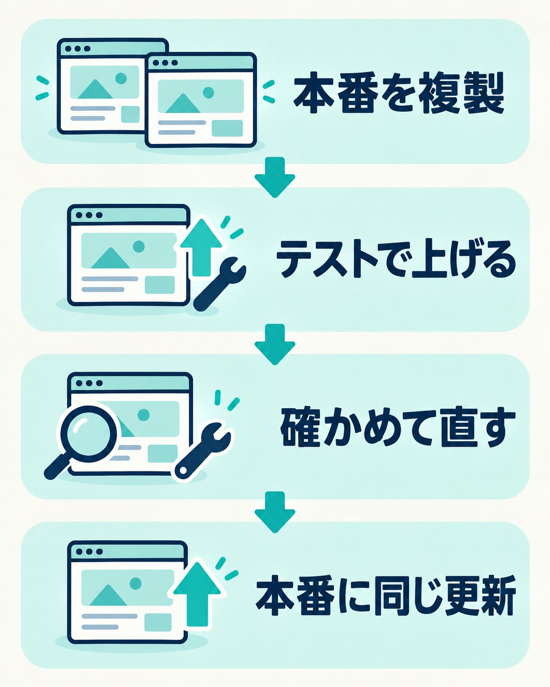

WordPressの更新を、表示が崩れるのが怖くて止めている。そういうサイトは少なくありません。ふだんはブログやお知らせを書くだけなので、更新しなくても困ることはありません。

ところが、WordPress本体に欠陥が見つかると話が変わります。欠陥を直した版に上げないかぎり、そこを狙われるおそれが残るからです。とはいえ、今のサイトの表示に問題があるわけではないので、表示を崩さずに、サイトも止めずに上げたい。

この記事では、更新を止めていたいくつものWordPressを、テスト環境で先に上げてから本番へ反映した例をもとに、手順と判断の仕方をまとめます。

## 更新を止めていたサイトを、なぜ今上げるのか

今回のサイトは、どれも納品したあとに持ち主の方が自分で運用していたものです。運用といっても、ブログを書いたり、お知らせを足したりする程度です。

WordPress本体とプラグインの更新は、表示が崩れないように止めていました。サイトを作る側が、更新を止めた状態で納品するのは珍しいことではありません（理由と、止めたままにしたときに起きたことは「[WordPressの乗っ取りに気づいたら？見逃しやすい兆候と、最初にやること・やってはいけないこと](/blog/wordpress-hijacked)」に書いています）。

きっかけは、WordPress本体に欠陥が見つかったことです。欠陥は、直した版に上げないと塞がりません。更新を止めているサイトは、自動では直りません。

## 本番で直接上げずに、テスト環境で先に上げる

持ち主の方から見れば、今のサイトの表示には何の問題もありません。だからこそ、「サイトを止めずに、表示も変えずに、安全にバージョンを上げる」ことが必要になります。

そこで、本番のサイトを丸ごと複製したテスト環境を用意し、先にそちらで上げる方法を提案しました。テストで問題が出ても本番には影響しないので、直してから本番に同じ更新をかけられます。この説明で「それでお願いします」と了承をいただき、作業に入りました。

_本番を複製し、テストで上げて確かめてから、本番に同じ更新をかけます。_

テスト環境を作るときに気をつけたのが、メールです。お問い合わせやメールマガジンを送るプラグインが入っていると、テスト環境から本物のお客さんへメールが飛んでしまうおそれがあります。テスト環境では、メールを送るプラグインを止めておきました。

## テスト環境で起きたこと

何年分もの更新をまとめてかけると、いくつかのサイトでつまずきが出ました。どれもテスト環境で見つかったので、本番では起きていません。

**更新した直後に、サーバーのエラーで画面が開かない**
新しいWordPressは、サーバーの古いPHPでは動かないことがあります。サーバー側のPHPを新しい版に切り替えると開くようになりました。

**画面が真っ白になる**
WordPressが使えるメモリの上限が低いままで、更新後のテーマやプラグインが足りなくなっていました。設定で上限を上げると表示が戻りました。真っ白になったときの確かめ方は「[WordPressの画面が真っ白になったら？原因別の対処法8選とログインできない時の復旧ガイド](/blog/wordpress-white-screen-recovery)」にもまとめています。

**ログイン画面に警告が出る**
PHPを新しい版にすると、設定ファイルの書き方の順番によって警告が出るサイトがありました。順番を直すか、そのサイトだけPHPを一つ前の版にとどめて対応しました。

**更新するたびに、プラグインが無効に戻る**
大きな版上げをやり直すたびに、あるプラグインが「無効」に戻っていたサイトがありました。画面はエラーなく開くので、見た目だけでは気づきにくいところです。更新の前に有効なプラグインの一覧を控え、更新の後に見比べることで見つかりました。

## 「本番に出してよい」をどう決めたか

判断は、まず機械的に行いました。更新の前と後で、各ページが正しく開くか、見出しや本文が同じように出ているかを機械で比べます。ここで差が出たところだけを目で見て、崩れていれば直します。

機械で比べられないのが、動きを伴うところです。

- お問い合わせフォームが送れるか
- 予約の画面が動くか
- 地図が表示されるか
- SNSの投稿を並べる部分が表示されるか

_機械で比べて差があるところだけ目で見ます。フォーム・予約・地図は、実際に操作して確かめます。_

こうした部分は、テスト環境で実際に操作して確かめました。

テストで問題がなければ、本番にも同じ更新をかけます。本番の動作確認は、持ち主の方にも手伝っていただきます。ふだんサイトを使っている方が、いつもの操作で違和感がないかを見てくださるのが、いちばん確かな確認になります。

## 有料プラグインのライセンスが切れていたら

いくつかのサイトで、有料プラグインのライセンスが切れていて、そのプラグインだけ最新に上げられないことがありました。ライセンスが有効でないと、新しい版を受け取れないためです。

持ち主の方には、選択肢と、私が勧める方を理由と一緒にお伝えしました。

- **ライセンスを買い直して最新にする**：勧める方です
- **そのまま置く**：今は問題なく動いていますが、勧めません

そのまま置くのを勧めない理由は2つあります。1つは、今は動いていても、この先のWordPressの更新にプラグインが追いつけず、使えなくなるおそれがあることです。もう1つは、今はそのプラグインに大きな欠陥が見つかっていなくても、見つかったときには、塞ぐためにどのみち買い直すことになることです。

このリスクを分かったうえで「そのままにしたい」ということであれば、それは持ち主の方の判断です。私の役目は、選べる道と、それぞれのリスクを並べて伝えることだと考えています。

別のプラグインに替える方法は、今回は提案していません。そのプラグインをやめたいということになれば、同じことを別の作り方でどう実現するかから考える話になるためです。

## 自分でバージョンアップするときに押さえたいこと

ご自分で更新する場合も、次の順番を守ると、表示を崩すおそれをぐっと下げられます。

1. 更新の前に、サイトのファイルとデータベースのバックアップを取る
2. 有効になっているプラグインの一覧を控えておく
3. できれば、本番を複製したテスト環境で先に上げる
4. サーバーのPHPが、新しいWordPressに対応した版になっているか確かめる
5. 更新の後に、表示・フォーム・予約・地図など、ふだん使っている機能を一つずつ確かめる
6. プラグインの一覧を、更新の前と見比べる

古い版から一気に上げるほど、つまずきは増えます。何年も更新していないサイトほど、テスト環境で先に試す価値があります。

## まとめ

表示が崩れるのを避けて更新を止めていたWordPressでも、テスト環境で先に上げて確かめれば、サイトを止めずにバージョンアップできます。判断は機械で比べたうえで差のあるところを目で見て、フォームや予約など動きのあるところは実際に操作して確かめます。有料プラグインのライセンスが切れていたら、選択肢とリスクを並べて、持ち主の方に決めていただきます。

更新が止まったままのWordPressは、本体に欠陥が見つかったときに、いちばん狙われやすい状態です。気になる方は、まず管理画面の「更新」の画面で、今のバージョンを確かめてみてください。
